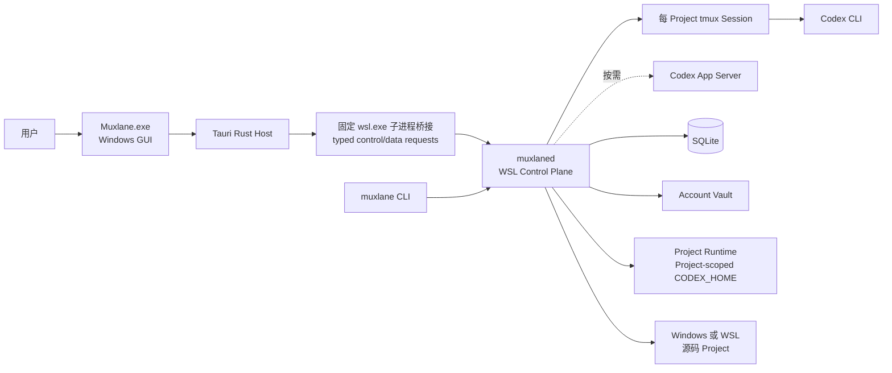
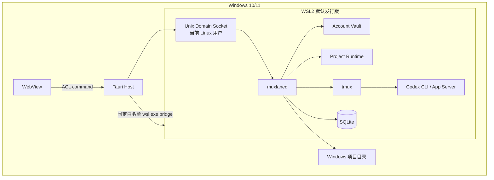

# Muxlane 总体架构

## 1. 状态与架构目标

| 项目     | 内容                                                            |
| -------- | --------------------------------------------------------------- |
| 状态     | Frozen baseline + ADR-0013 scope revision                       |
| 变更原则 | 阶段 1 基线由后续 ADR 修订；实现状态以 `docs/PROJECT.md` 为准。 |

本文保留阶段 1 架构基线，并记录后续已验证边界。Muxlane 是本地优先、轻量、可恢复、可诊断的 Windows/WSL Codex Runtime 工作台：项目级隔离与凭证安全优先于完整 IDE 功能。当前实现状态见 [项目真相](PROJECT.md)。

## 2. 系统上下文



Windows GUI 提供 React、xterm.js、状态展示、输入转发、托盘、初始化/恢复、模板/预设/输入历史和只读文件导航。Tauri Host 通过 Capability/ACL 与白名单命令桥接 Windows 和 WSL，禁止 WebView 任意 Shell，也禁止其直接读取 Account Vault。`muxlaned` 负责 Vault、Registry、Runtime、凭证事务、双锁、Recovery、`tmux`、Terminal Gateway、Codex App Server Client、Usage、只读 Workspace Service、SQLite Migration、日志脱敏与进程监督。统一 Asset、CodeMirror 与文件写入由 [ADR-0013](adr/0013-reframe-phase-7-as-safe-local-workbench.md) 延期。

## 3. 信任边界与部署拓扑



信任边界包括 WebView/Tauri Host、Windows/WSL、GUI/Daemon、Unix Socket、Daemon/项目目录、Daemon/Account Vault、Daemon/Codex CLI、Daemon/`tmux` 和诊断包导出。Windows GUI 在 Windows；Daemon、CLI、`tmux`、Codex CLI 和数据目录在 WSL。源码可在任一文件系统，但 Runtime 必须在 WSL Linux 文件系统。MVP 不监听 LAN，不管理多个发行版。

## 4. 进程、通信与数据

进程模型为一个 Windows GUI、一个统一 `muxlaned`、多个 Project `tmux` Session、每 Project 最多一个受管 Codex 主实例，并按需启动 App Server；不为每 Account 常驻 App Server。GUI 关闭不等于 Daemon 或 Codex 退出。

控制面是版本化 JSON-RPC，连接必须握手；WSL 内使用仅当前 Linux 用户可访问的 Unix Domain Socket。Terminal 流量与控制 RPC 分离。Windows 到 WSL 通过 Tauri Host 启动固定 `wsl.exe --exec /usr/bin/env muxlane` control client 和 `muxlaned terminal-gateway`；参数只能来自 typed Protocol enum，调用有输出上限与超时，不开放 LAN listener，断开后重新握手。

```text
~/.local/share/muxlane/
├── accounts/<account-id>/{auth.json,metadata.json,query-home/}
├── projects/<project-id>/{metadata.json,codex-home/,logs/}
├── archives/
├── locks/{accounts/,projects/}
├── transactions/
├── recovery/
└── muxlane.db
```

Account Vault 目录为 `0700`，`auth.json` 为 `0600`，敏感文件只归当前 Linux 用户。Project Runtime、日志和活动凭证彼此隔离。事务、Recovery、锁和凭证目录在实际写入路径执行 fsync；SQLite 保存非秘密元数据、状态索引、事务、模板/预设和输入历史，绝不保存 Token、Terminal 输出或原始上游响应。Project ID 由 canonical path 的稳定 hash 派生并与可读名称分离。归档为逻辑归档，非立即物理删除。

## 5. Project Runtime、凭证与锁

每个 Project Runtime 永久持有 `config.toml`、Session、Codex 内部 SQLite/状态、history、logs、caches 与项目运行缓存；启动时临时持有 `auth.json`。它与源码目录分离，Account 切换不改变它。

凭证高层流程为 Account Vault → 原子 Credential Checkout → Runtime `auth.json` → Codex 运行/refresh → 原子 Credential Commit → Cleanup。正式实现要求临时文件、`0600`、fsync、同目录原子 rename、目录 fsync、持久事务、Hash、冲突保留和幂等 Recovery。详细定义见阶段 1B 的 [Runtime 生命周期](RUNTIME_LIFECYCLE.md)、[持久恢复状态机](RECOVERY_STATE_MACHINE.md) 和 [威胁模型](THREAT_MODEL.md)；它们仍是待 POC 验证的设计，并非已实现能力。

每次 Launch Transaction 同时取得 Project Lock 与 Account Lock。Linux `flock` 是排他真相，SQLite 仅记录状态。固定获取顺序为 Account Lock 再 Project Lock，以降低死锁；记录结合 `boot_id`、PID、进程启动时间和事务 ID，心跳不是最终真相。锁冲突不抢占、不自动切号；WSL 重启和 PID 重用交给 Recovery 重判。

## 6. Terminal、App Server 与安全工作台

每个 Project 一个 `tmux` Session，可有多个 Window；MVP 不支持 Pane。Session 包含 Codex 主 Terminal、辅助 Shell、后端、前端和自定义 Terminal。Daemon 通过 `tmux` Control Mode 获取状态和历史缓冲，GUI 使用 xterm.js 重连。缓冲必须有上限。

Codex App Server 和 Usage Query 按需启动，使用独立 Query Home、并发限制和短期缓存。字段以当前安装 CLI 实际能力/Schema 探测为准；Usage Window 用 `windowDurationMins` 识别。工作台只保存非秘密 template/preset 和明确提交的 Prompt/Shell 输入；Terminal 输出不进入历史。Workspace Service 只允许 canonical Project root 下的文本 list/search/preview/location，拒绝穿越、symlink、二进制和超限文件。Asset/CodeMirror/文件写入明确延期。

## 7. 关闭、Recovery 与可观测性

窗口关闭、最小化到托盘、完全退出和智能关闭是不同用户动作；存在受管任务时要求用户选择，不执行 `wsl --shutdown`。GUI 重启提供恢复入口，CLI 始终可用于诊断与 Recovery。

Daemon 设计为输出结构化脱敏日志、事务事件、进程身份、健康状态和 `doctor` 结果；诊断包必须经脱敏并由用户主动导出，默认不上传。崩溃日志上传需要用户明确授权。

轻量化约束：单 Daemon、App Server 按需、前端懒加载、文件树虚拟化、Terminal 历史上限；不提前增加依赖或没有当前调用方的抽象。

## 8. 阶段映射、风险与资料

阶段 2：Project Runtime、凭证刷新与 Account 接管 POC；阶段 3：Terminal、Windows—WSL Bridge、重连与背压 POC；阶段 4：锁、Launch Transaction、故障注入与冲突 Recovery POC；阶段 5：正式后台、SQLite、控制协议与 CLI；阶段 6：Windows GUI、Usage、正式 Terminal 与托盘；阶段 7：安全本地工作台；阶段 8：发布、安全、性能与运维。

已验证风险包括固定 Windows→WSL bridge、`tmux` Control Mode、PID/boot identity、SQLite migration、Tauri capability 与 WebView Terminal 输入边界。持续风险是 Codex CLI/App Server Schema 演进、真实账号 Usage、不同 WSL/Windows 版本差异、前端 bundle 性能和诊断脱敏。逻辑协议、数据模型和兼容策略见 [Protocol](PROTOCOL.md)、[Data Model](DATA_MODEL.md) 与 [Compatibility](COMPATIBILITY.md)。

设计核验参考：[WSL 官方概览](https://learn.microsoft.com/windows/wsl/about)、[Tauri 2 Capabilities](https://v2.tauri.app/security/capabilities/)、[JSON-RPC 2.0](https://www.jsonrpc.org/specification)。本地只读检查的 Codex CLI 为 `0.144.1`；其 App Server 为实验性能力，未在本文冻结字段或传输细节。
