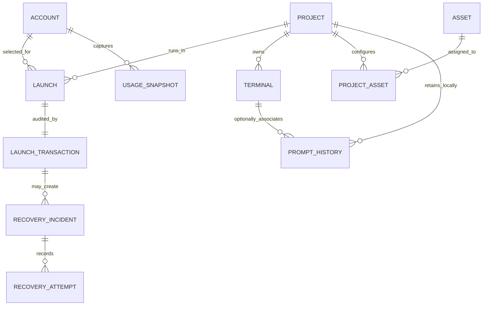

# Muxlane 逻辑数据模型与事实来源

## 1. 文档状态与模型原则

| 项目   | 内容                                                                                                                                                                                            |
| ------ | ----------------------------------------------------------------------------------------------------------------------------------------------------------------------------------------------- |
| 状态   | Frozen（阶段 1）                                                                                                                                                                                |
| 范围   | 逻辑实体、所有权、事实来源、迁移与保留原则                                                                                                                                                      |
| 非目标 | 不创建 SQLite schema、SQL migration、ORM、Rust struct 或 Repository                                                                                                                             |
| 关联   | [协议](PROTOCOL.md)、[恢复状态机](RECOVERY_STATE_MACHINE.md)、[ADR-0009](adr/0009-sqlite-for-metadata-not-credentials.md) 与 [ADR-0012](adr/0012-forward-only-versioned-database-migrations.md) |

本模型的目的不是把每个概念立即变成表，而是让每条安全和恢复决策只有一个主事实来源。

1. SQLite 保存非敏感元数据、关系、状态索引、迁移记录与事务记录；Token、refresh token 和完整 `auth.json` 绝不进入 SQLite。
2. Account Vault 保存 Account 凭证文件；Project Runtime 保存项目级 `CODEX_HOME` 与活动 Runtime 文件。
3. 实际 `flock` 是活动互斥事实，SQLite 占用摘要和锁文件存在性仅供索引/诊断。
4. durable Launch Transaction 是 Launch 的恢复审计事实；它不等同 GUI 快照、心跳或单个 PID。
5. OS `boot_id` 与 `/proc` 是进程身份输入；tmux 是终端存活与有界缓冲载体；GUI/React state 永远不是事实来源。
6. 非原子跨 SQLite/文件系统操作必须通过 durable state machine、受控文件操作和幂等 Recovery 收口，不能伪称一个 SQLite transaction 同时提交了文件系统副作用。

## 2. Source of Truth 矩阵

| 数据            | 唯一主事实来源                                                   | 缓存/索引                              | 禁止作为事实来源             |
| --------------- | ---------------------------------------------------------------- | -------------------------------------- | ---------------------------- |
| Account 凭证    | Account Vault 中受控凭证文件                                     | `credential_hash`、脱敏 Account 元数据 | SQLite Token 字段、GUI、日志 |
| Project Runtime | WSL 受控文件系统中的 Project Runtime                             | Project 表的受控相对路径               | GUI 缓存、源码目录           |
| 活动锁          | 已实际持有的 Linux `flock`                                       | SQLite 占用摘要、锁路径                | 锁文件存在性、心跳           |
| Launch 状态     | durable Launch Transaction                                       | Launch 视图、GUI snapshot              | heartbeat、客户端事件缓存    |
| 进程身份        | 当前 `boot_id` + PID + start ticks + process identity 的组合检查 | transaction 已记录候选字段             | PID alone、tmux 存在性       |
| 终端内容        | 受管 tmux/PTY 的当前内容与有界 history                           | GUI scrollback、Terminal metadata      | React state、无限轮询缓存    |
| Usage           | 经能力探测的 Codex capability query result                       | UsageSnapshot                          | hardcoded 上游字段、GUI 推测 |
| Recovery 结果   | RecoveryIncident/RecoveryAttempt 关联记录及其证据引用            | 事务摘要                               | 直接改写旧终态 transaction   |

主事实来源冲突时，Daemon 必须拒绝或进入 Recovery/诊断，而非按最后更新时间、GUI 缓存或单一记录猜测。

## 3. 标识符与路径策略

| ID                     | 语义与规则                                                                                                                                                                         |
| ---------------------- | ---------------------------------------------------------------------------------------------------------------------------------------------------------------------------------- |
| `account_id`           | 不透明、稳定 ID；不得包含邮箱、Token、凭证路径或可认证信息。                                                                                                                       |
| `project_id`           | `project_<stable-path-hash>` 的逻辑形式，并与独立可读 `name` 组合展示；不包含完整路径。规范化版本、大小写、符号链接和 hash 输入是 **阶段 2 Candidate / POC validation required**。 |
| Runtime                | Project 的一对一隐式子资源，不分配独立外部 `runtime_id`。                                                                                                                          |
| `terminal_id`          | Project 内稳定、不透明 Terminal ID；不以 tmux window 名称作为外部 ID。                                                                                                             |
| `launch_id`            | 用户可见的一次 Launch 记录 ID。                                                                                                                                                    |
| `transaction_id`       | 不可预测的 durable Launch Transaction ID；用于恢复关联，不是数据库行号。                                                                                                           |
| `recovery_incident_id` | 对一个需要诊断/操作的 Recovery 分类的稳定 ID。                                                                                                                                     |
| `attempt_id`           | RecoveryAttempt 的不可变审计 ID。                                                                                                                                                  |
| `asset_id`             | 受治理 Asset 的稳定 ID；与名称、来源和 checksum 分离。                                                                                                                             |
| `usage_snapshot_id`    | 单次安全归一化 Usage 捕获 ID。                                                                                                                                                     |
| `operation_id`         | Client 发起写操作的不可预测幂等/审计键；不等于 JSON-RPC request `id`。                                                                                                             |

不得用 SQLite 自增整数作为跨 GUI、Daemon、CLI 或诊断包的稳定 ID。`project_id` 的 hash 是本地元数据而非保密机制：外部导出仍须脱敏路径和不必要的可关联 ID。Path hash 算法、Windows/WSL 路径对照、Unicode、大小写和重注册语义在 POC 验证前不属于稳定外部合同。

## 4. 逻辑实体

### 4.1 Account

| 字段                                      | 规则                                              |
| ----------------------------------------- | ------------------------------------------------- |
| `account_id`                              | 不透明稳定 ID。                                   |
| `display_name`                            | 用户可编辑的非秘密展示名。                        |
| `masked_email`                            | 可选、已脱敏展示值；不作为身份或 ID。             |
| `plan_type`                               | 已归一化的非秘密计划摘要；未知值安全显示。        |
| `login_status`                            | 不携带 Token 的状态摘要。                         |
| `vault_relative_path`                     | 仅受控 Vault 根下的相对引用；不允许任意绝对路径。 |
| `credential_hash`                         | 凭证文件变化检测摘要；不得可逆为凭证。            |
| `occupancy_summary`                       | 诊断/显示缓存，真实占用仍由 `flock` 决定。        |
| `archived_at`、`created_at`、`updated_at` | 可审计时间。                                      |

Account 不保存 access token、refresh token、完整 `auth.json` 或未脱敏上游凭证响应。

### 4.2 Project 与隐式 Runtime

Project 字段：`project_id`、`name`、`canonical_windows_path`、`canonical_wsl_path`、`runtime_relative_path`、`default_model`、`default_reasoning`、`tmux_session_name`、`archived_at`、`created_at`、`updated_at`。

这些路径都是 Sensitive local metadata：数据库只保存受控、已验证值；RPC 默认只返回足以显示的安全表示；诊断包以路径占位或 hash 代替原文。不得将 raw path 写入错误、日志或不受控导出。

选择 **A：Runtime 是 Project 的一对一隐式子资源，不单独建表**。理由是 Runtime 没有独立用户生命周期、所有者、归档策略或跨 Project 关系；单独实体只会制造一个无业务含义的 ID。Project 的 `runtime_relative_path` 指向其唯一、受控的 Project Runtime，实际目录仍是 Runtime 文件的主事实来源。

### 4.3 Terminal

`Terminal` 包含 `terminal_id`、`project_id`、`kind`、`display_name`、`tmux_window_identity`、`ordinal`、`lifecycle_status`、`created_at`、`closed_at`。`tmux_window_identity` 是受管关联证据而非公开 API 或运行事实；终端是否有活进程仍需 tmux/PTY 与进程身份检查。`ordinal` 仅排序，不是稳定外部标识。

### 4.4 Launch 与 LaunchTransaction

`Launch` 是用户可见运行记录，包含 `launch_id`、`project_id`、`account_id`、`selected_model`、`selected_reasoning`、`state_summary`、`started_at`、`exited_at`、`outcome`。它不能替代 durable transaction，也不能保存凭证内容。

`LaunchTransaction` 是该 Launch 的恢复事实，包含：

- `transaction_id`、`launch_id`、`project_id`、`account_id`、`state`；
- `runner_pid`、`codex_pid`、`boot_id`、`process_start_ticks`、`process_identity`；
- `vault_hash_before_checkout`、`runtime_hash_at_checkout`、`runtime_hash_at_recovery`、`vault_hash_at_recovery`；
- `credential_backup_reference`（受控相对引用，绝不为任意用户路径）；
- `created_at`、`updated_at`、`last_error_code`、`last_error_message_redacted`；
- `recovery_attempts`、`recovered_at`、`schema_version`。

每个 `Launch` 与一个 `LaunchTransaction` 是 1:1：Launch 的含义就是一次启动/退出尝试，重复 Launch 创建新的 `launch_id` 和 `transaction_id`，不把多次运行混入一条历史。此选择避免把用户可见历史误当成可改写的“重试容器”。

`finished`、`recovered`、`credential_conflict` 和 `failed` 都是不可变历史终态。尤其 `failed` 不能被直接更新成成功、`recovered` 或 `credential_conflict`；成功恢复动作也不能伪造旧 Launch 正常结束。

### 4.5 RecoveryIncident 与 RecoveryAttempt

`RecoveryIncident`：`incident_id`、`transaction_id`、`classification`、`detected_at`、`status`、`requires_user_action`、`evidence_references`、`resolution_summary`、`resolved_by_action`、`resolved_at`。`status` 是启动阻断的事实：只有关联 RecoveryAttempt 已验证无活动锁、身份或凭证风险，才能从 `open` 变为 `resolved`。

`RecoveryAttempt`：`attempt_id`、`incident_id`、`transaction_id`、`attempt_number`、`action`、`started_at`、`completed_at`、`outcome`、`error_code`、`redacted_message`。

人工修复或重试会创建新的 RecoveryAttempt（必要时新的 incident），并把 outcome 记录为 `safe_cleanup_completed`、`conflict_preserved`、`failed` 等；它**不会**修改旧 Transaction 的终态。安全收口的 Attempt 可以将关联 Incident 标为 `resolved`，从而解除 Account/Project 的启动阻断；凭证冲突、身份不明、活动锁或不安全证据仍保持 `open`。若用户选择发起新的受管运行，则创建新的 Launch/Transaction。这样 `recovered` 始终表示无冲突地完成原 Transaction 的自动或崩溃收尾，而不会掩盖此前的 `failed` 历史。

### 4.6 UsageSnapshot

`UsageSnapshot` 包含 `usage_snapshot_id`、`account_id`、`captured_at`、`source_cli_version`、`source_capabilities`、`raw_schema_version` 或安全 adapter version、`normalized_windows`、`token_usage_summary`、`reset_credit_summary`、`status`、`expires_at`、`error_code`。

这里只保存已 allowlist 的归一化摘要和错误代码；不保存未脱敏原始上游响应。`account/read`、`account/rateLimits/read`、`account/usage/read` 只是当前设计关注的 **Candidate capability names**，实际上游方法/字段必须通过官方 Schema 或无副作用探测确定。

### 4.7 Asset、ProjectAsset、PromptHistory 与 Settings

`Asset`：`asset_id`、`type`、`source`、`version`、`checksum`、`compatibility`、`install_mode`、`metadata`、`created_at`、`updated_at`。`ProjectAsset`：`project_id`、`asset_id`、`enabled`、`project_override`、`last_validation_status`。这两个实体是阶段 7 设计边界，非当前实现合同。

`PromptHistory` 只冻结后续工作台的逻辑字段：`project_id`、`thread_id`、`terminal_id`、`input_text`、`submitted_at`、`status`。默认仅本地，不作为遥测；诊断包默认排除或强脱敏，具体保留期留到阶段 7。

`Settings` 分为全局非敏感设置和项目级非敏感设置。敏感数据、凭证、Token、完整上游响应或诊断秘密不得进入普通 settings 表。

## 5. 关系与约束

关键约束：

1. 同一时间一个 Account 最多一个活动 Launch；同一时间一个 Project 最多一个活动 Launch。
2. SQLite 唯一索引只做防御性约束，不能代替 **Account Lock → Project Lock** 的真实 `flock` 获取；释放顺序相反。
3. Account、Project 和 Asset 引用采用归档/软删除，不物理删除历史记录。
4. 终态 Transaction 不得原地改写为成功，RecoveryAttempt 必须保留失败或人工处理证据。
5. 敏感文件路径只能用受控根下的相对引用；任何解析都须在 Daemon 中验证。
6. 数据库级联删除不得删除实际 Vault、Runtime、归档或冲突文件。

### Vault 已变化、Runtime 未变化的清理守卫

Hash 矩阵的这一分支不能仅凭“Runtime 等于 checkout hash”清理。必须同时确认：原 Codex/Runner 已不存在；已完成 `boot_id` 与进程身份检查；Runtime hash 等于签出基线；没有 Runtime 更新；保留审计记录；清理动作可幂等。否则保留证据并进入 `failed` 或人工 Recovery，不覆盖 Vault。

## 6. 生命周期、归档与保留

| 对象                 | 规则                                                                                                                 |
| -------------------- | -------------------------------------------------------------------------------------------------------------------- |
| Account              | 只能在无活动 Account Lock、无活动 Launch、无未解决 RecoveryIncident/凭证事务时归档；凭证的物理处置需要后续明确流程。 |
| Project              | 只逻辑归档；先确认无运行、无 Runtime `auth.json`、无待签回事务、无未解决 RecoveryIncident 与真实活动锁。             |
| Terminal             | `closed_at` 标记关闭；不因 GUI 断开而关闭 tmux 或删除历史。                                                          |
| Launch / Transaction | 历史保留，不因新 Launch 覆盖；终态不可改写。                                                                         |
| Recovery evidence    | 保留受控证据引用和脱敏摘要，按后续保留策略清理敏感副本前确认可恢复性。                                               |
| UsageSnapshot        | 按 `expires_at` 过期；过期不是删除审计事实。                                                                         |
| Asset                | 归档/移除前检查 ProjectAsset 引用和兼容性。                                                                          |

数据库记录与文件系统归档必须先检查活动凭证与真实锁，后记录可恢复意图，再执行受控文件动作并持久化后继状态。归档是幂等操作，不能通过删除锁文件、数据库行或未知 tmux Session “完成”。

## 7. SQLite 与文件系统边界

| SQLite（非敏感）                                                                                                         | 文件系统（受控但可能敏感）                                                                                                             |
| ------------------------------------------------------------------------------------------------------------------------ | -------------------------------------------------------------------------------------------------------------------------------------- |
| metadata、关系、状态索引、LaunchTransaction、RecoveryIncident/Attempt、UsageSnapshot、Settings、schema/migration history | `auth.json`、凭证备份/冲突副本、Project `CODEX_HOME`、Codex sessions、Codex 内部数据库、history、logs、tmux 运行资源、诊断包、归档文件 |

- SQLite 路径只能引用 Muxlane 受控目录；不得无脱敏策略存任意绝对敏感路径。
- SQLite transaction 不是文件系统原子事务；一次 DB commit 不能证明 rename、`fsync` 或目录持久化已经完成。
- 跨 SQLite 与文件系统操作先持久化意图，执行可验证副作用，再持久化后继状态；中断由 [恢复状态机](RECOVERY_STATE_MACHINE.md) 和 RecoveryAttempt 解释。
- SQLite 不保存 Token、完整 `auth.json`、Prompt、原始终端流或未脱敏上游响应；SQLite 也不替代 Account Vault 或 `flock`。

## 8. 数据库事务边界

1. 单次数据库状态转换在数据库 transaction 内提交，且必须校验 expected state（compare-and-set）或等价不变量。
2. 不可逆外部副作用前先持久化意图；文件系统动作确认后才持久化后继状态。
3. 任何非法状态转换必须拒绝，而不是“修正”旧记录。
4. 崩溃点由 Transaction state、Hash、受控文件检查、真实锁与进程身份共同解释。
5. 文件系统完成但 DB 未写入、DB 写入但文件系统未完成等情况都必须可幂等恢复；不得假设 SQLite commit 与 rename 是一个原子动作。

## 9. Schema 版本与迁移

`schema_version`、migration history 与迁移锁属于 SQLite 的逻辑职责。迁移采用向前迁移：迁移前执行健康检查和备份；迁移期间禁止业务写操作；完成后才允许新 Schema 的写请求。

- 迁移失败进入诊断状态，保留原数据库、备份和脱敏错误；不得静默重建或通过删除数据库“修复”。
- 失败回滚边界是发布前备份与可诊断恢复，不承诺任意版本无损写入降级。
- 新 GUI/旧 Daemon 与旧 GUI/新 Daemon 必须先走协议握手；不能理解 schema/能力的一方只允许必要只读诊断，不能业务写入。
- 新 Schema 被写入后，降级版本默认不得打开它执行写操作。
- 本轮不写任何 SQL；最终 migration 及索引由阶段 5 实现与基准验证。

## 10. 索引与查询候选

以下仅是逻辑查询需求，不冻结数据库索引 DDL：

- active Launch by Account；active Launch by Project；Transaction by state；
- unresolved RecoveryIncident；latest UsageSnapshot by Account；
- Terminal order by Project；Project/Account archived status；Asset references。

实际索引、唯一约束、WAL/journal mode 与并发性能由阶段 5 实现和基准验证决定。

## 11. 敏感数据分类

| 等级                     | 示例                                                                               | 处理                                                            |
| ------------------------ | ---------------------------------------------------------------------------------- | --------------------------------------------------------------- |
| Secret                   | access token、refresh token、完整 `auth.json`                                      | 仅受控 Vault/Runtime 文件；不进 SQLite、RPC、普通日志或诊断包。 |
| Sensitive local metadata | canonical path、masked email、credential hash、process identity 摘要、受控证据引用 | 最小化存储/显示，日志和导出脱敏。                               |
| Operational metadata     | 状态、时间、非敏感 ID、锁摘要、迁移版本、错误代码                                  | SQLite 与结构化日志允许，但仍遵循最小化。                       |
| Public project metadata  | 项目显示名、开源 Asset 的公开来源/版本/checksum                                    | 可显示，但不应借此推断本地秘密。                                |

## 12. 数据保留与诊断包

Muxlane 默认无遥测。诊断包必须由用户主动导出，排除 Token、`auth.json`、凭证备份/冲突副本、Prompt 和终端日志；后两者只有用户明确选择并通过强脱敏策略时才可能纳入。路径默认脱敏，Recovery evidence 只导出安全摘要、分类和受控 ID，不导出原始内容。

数据保留期限、用户可见清理 UX 与 PromptHistory 细则留到阶段 7；在此之前不得把“本地”解释为可任意长期保留或公开导出。

## 13. POC 验证项

阶段 2 必须验证 Windows/WSL 路径规范化、path hash 与凭证 Hash 选择；阶段 4 必须验证 SQLite/文件系统跨边界崩溃、状态 compare-and-set、磁盘满、权限错误、数据库损坏、迁移失败、并发唯一约束和归档幂等；阶段 5 必须验证 WAL 或 journal mode、正式 SQLite 实现和迁移。任何 POC 结果若推翻本模型，必须先通过 ADR/文档修订收口，再实现正式业务代码。
