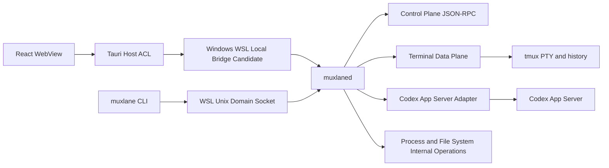
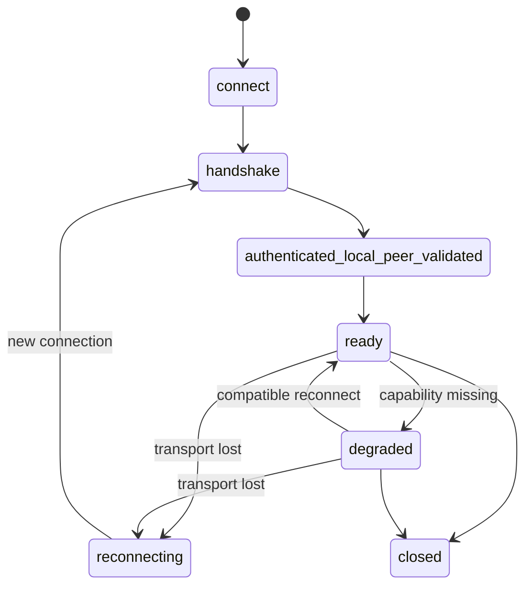

# Muxlane 逻辑控制协议

## 1. 文档状态

| 项目     | 内容                                                                                                |
| -------- | --------------------------------------------------------------------------------------------------- |
| 状态     | Frozen（阶段 1）                                                                                    |
| 逻辑版本 | Protocol v1 Candidate（`1.0`）；仅 MVP 列为候选合同，Future 项只保留命名空间                        |
| 已实现性 | 未实现；本文件不是 Server、Client 或传输实现规范                                                    |
| 传输状态 | 尚未通过阶段 3 Windows—WSL 传输 POC；具体桥接不是当前稳定合同                                       |
| 上游边界 | Codex App Server 协议不等于 Muxlane 内部协议；其 Schema、字段和命令均须以官方资料或无副作用探测验证 |

本文件冻结 GUI、Tauri Host、`muxlaned` 与 `muxlane` CLI 之间的**逻辑控制协议设计**，而不是已实现的稳定 wire contract。它补充 [总体架构](ARCHITECTURE.md)、[Runtime 生命周期](RUNTIME_LIFECYCLE.md) 与 [恢复状态机](RECOVERY_STATE_MACHINE.md)，但不替代它们的锁、凭证或恢复不变量；后续 POC 若推翻本设计，必须通过新的 ADR 修订。

未通过 POC、未被当前上游 Schema 证明的项目必须标作 **Candidate**、**Capability-probed**、**POC validation required** 或 **Not part of the stable contract**。阶段 1C 不实现任何 RPC、Socket、Bridge 或终端通道。

## 2. 协议参与者

| 参与者                   | 角色                                            | 可见边界                                                |
| ------------------------ | ----------------------------------------------- | ------------------------------------------------------- |
| Windows React WebView    | 显示与用户意图；只能经 Tauri 白名单请求控制操作 | 不能读取 Vault、tmux Socket 或任意文件/命令             |
| Tauri Host               | Windows 侧受限 Host 与 ACL 执行点               | 只能调用已允许的 Daemon 方法；不能把 WebView 变成 Shell |
| Windows—WSL Local Bridge | 候选本机桥接层                                  | 具体进程、管道、端口和身份绑定待阶段 3 POC              |
| `muxlaned`               | WSL Control Plane、授权、状态协调与事件发布者   | 唯一协调 Vault、Runtime、锁、事务和 tmux 的受管方       |
| `muxlane` CLI            | 当前 WSL 用户的 CLI 客户端和诊断入口            | 通过本地授权连接读取或发起受限操作                      |
| Terminal Gateway         | 终端控制与数据流边界                            | 不把 PTY 高频字节流伪装为普通控制事件                   |
| `tmux`                   | Project 终端存活与有界历史的载体                | Session 存在不证明 Codex 仍运行                         |
| Codex CLI                | 受管 Launch 的实际 CLI 进程                     | 不是 Muxlane RPC 参与者                                 |
| Codex App Server         | 可选、按需的上游适配对象                        | Candidate；不会把其未验证字段转成 Muxlane 合同          |

## 3. 协议分层



1. **Control Plane** 是版本化 JSON-RPC 2.0：低频命令、状态读取、事务操作、能力协商和元数据事件。
2. **Terminal Data Plane** 是独立的 attach/detach 后数据流，负责 PTY 字节、背压和历史恢复；不能无限把终端输出作为 JSON-RPC notification 发送。
3. **Codex App Server Adapter** 是 Daemon 内部的 capability-based 适配层，隔离上游实验性 Schema；不是 GUI 或 CLI 的直接目标。
4. **Process/File-System Internal Operations** 包括 `flock`、事务持久化、Vault、Runtime、tmux 和进程身份检查；它们不因存在同名 RPC 就暴露为任意文件或 Shell 操作。

## 4. 传输与本地身份原则

- 仅允许本地传输；Muxlane 不监听 LAN，也不把控制面公开为远程服务。
- WSL 内优先使用仅当前 Linux 用户可访问的 Unix Domain Socket。Socket 目录、所有者和模式是实现时的安全检查项。
- Windows—WSL 最终桥接方式、命名管道名称、TCP 端口、桥接可执行文件和帧格式均为 **POC validation required**，不属于稳定合同。
- 传输层断开不等于 Launch、`tmux`、Runner 或 Codex 退出；连接丢失不得自动释放 Account/Project 锁。
- 每一次连接或重连都必须重新握手并完成 local-peer validation；先前 session 不能凭客户端缓存续用。
- WebView 绝不能直接连接 Account Vault、tmux Socket、Daemon Socket 或任意 Shell。

## 5. JSON-RPC Envelope

Control Plane 使用 JSON-RPC 2.0 的对象消息。Protocol v1 不支持 JSON-RPC Batch；收到数组必须返回 `INVALID_REQUEST`，而不是部分执行。

| 消息     | 必需字段                         | 规则                                                                        |
| -------- | -------------------------------- | --------------------------------------------------------------------------- |
| 请求     | `jsonrpc: "2.0"`、`id`、`method` | `id` 必须是非空 string；`method` 是命名空间英文名；`params` 省略或为 object |
| 通知     | `jsonrpc: "2.0"`、`method`       | 没有 `id`，不得返回响应；只用于事件和不会要求确认的提示                     |
| 成功响应 | `jsonrpc: "2.0"`、`id`、`result` | `result` 是 object；没有 `error`                                            |
| 错误响应 | `jsonrpc: "2.0"`、`id`、`error`  | `error` 与 `result` 互斥；错误内容必须脱敏                                  |

- Protocol v1 只接受命名参数 object；空参数可以省略或使用 `{}`，两者语义相同。`null` 不是有效 `params`。
- `id` 不使用 number 或 `null`，避免精度、重放和关联歧义；请求 ID 只在当前连接内关联响应，不是幂等键。
- 接收方忽略其理解范围以外的**可选**对象字段；未知必填字段、未知方法或无法安全忽略的结构返回明确错误。未知枚举值必须保留为 `unknown`/`unavailable` 语义，不得猜测为已知状态。
- 最大控制消息大小是可配置的兼容参数，在握手 `limits.max_control_message_bytes` 中公布；具体默认值和大消息实现待阶段 3 POC。
- 普通错误、事件和 correlation ID 不得包含 Token、完整 `auth.json`、未脱敏命令行、Prompt、终端内容或敏感本地文件内容。

## 6. 握手与能力协商

每个连接的第一个业务请求必须是 `system.handshake`。完成 local-peer validation 前，服务端只允许握手、`system.health` 和最小只读诊断；其它方法返回 `PERMISSION_DENIED` 或 `DAEMON_UNAVAILABLE`。

### 6.1 逻辑模型

| 方向         | 字段                                                                                                                                                                                                                                     |
| ------------ | ---------------------------------------------------------------------------------------------------------------------------------------------------------------------------------------------------------------------------------------- |
| Client hello | `protocol_version`、`client_kind`、`client_version`、`minimum_supported_protocol`、`maximum_supported_protocol`、`capabilities`、`platform`、`wsl_distribution_identity`、`session_id`                                                   |
| Server hello | `daemon_version`、`minimum_supported_protocol`、`maximum_supported_protocol`、`capabilities`、`platform`、`wsl_distribution_identity`、`session_id`、`server_instance_id`、`recovery_status_summary`、`compatibility_warnings`、`limits` |

`client_kind` 只能是 `tauri_host`、`cli` 或未来经 ADR 批准的本机受控客户端；WebView 不是直接 Daemon client。`session_id` 是连接级不透明 ID，`server_instance_id` 在 Daemon 实例重启后改变。二者不得包含用户名、邮箱、Token 或路径。

能力使用显式、稳定、英文 capability name，例如 `launch.observe.v1`、`recovery.execute.v1`、`terminal.attach.v1`、`usage.read.v1`。功能可用性只能由协商后的 capability 判断，不能仅猜测版本字符串。

### 6.2 协商结果

| 结果                      | 含义与行为                                                   |
| ------------------------- | ------------------------------------------------------------ |
| `compatible`              | 存在重叠协议版本，所请求能力可安全使用。                     |
| `degraded`                | 协议可互通，但至少一项非关键能力缺失；缺失能力必须显式显示。 |
| `incompatible`            | 无安全协议交集；禁止业务写操作，可保留只读诊断。             |
| `upgrade_required`        | 当前组合不能满足目标操作；响应同时给出 client/daemon 方向。  |
| `daemon_upgrade_required` | Client 所需的兼容合同高于 Daemon 上限。                      |
| `client_upgrade_required` | Daemon 不再接受 Client 的协议范围或关键安全语义。            |

## 7. 连接与会话生命周期



- GUI 断开、窗口关闭或重启不终止 Launch；同一 GUI 可用新 session 重连。
- GUI 与 CLI 可同时读取快照。写操作由 Daemon 授权、锁和状态机仲裁；并发写入不能以客户端“最后一次看到的状态”决定。
- 重连后 Client 必须先 `system.handshake`，再读取新快照；客户端缓存、旧事件序号和旧 terminal attachment 都不是事实来源。
- `ready` 表示本连接的协商完成，不表示 Daemon 健康、Launch 存在或任何锁已经取得。

## 8. 命名、共享模型与方法目录

方法名以小写英文命名空间和点分隔动词组成；不使用 Rust 类型名、SQLite 表名、凭证内容或用户路径。下面的 `Ref` 都只含不透明 ID：`AccountRef`、`ProjectRef`、`LaunchRef`、`TransactionRef`、`IncidentRef`、`TerminalRef`。`Operation` 含 Client 生成的 `operation_id`；它是写请求的去重/审计键而不是 JSON-RPC `id`。

表中“能力”为显式 capability；`core.read.v1` 是所有已握手本机 Client 的基础只读能力。错误码见第 10 节；“阶段”是目标实现阶段，不代表已实现。

| 方法                            | purpose / caller                        | request model → response model                                          | 幂等性与副作用                                               | 能力 / 可能错误                                                                                         | 合同状态 / 目标阶段 / POC         |
| ------------------------------- | --------------------------------------- | ----------------------------------------------------------------------- | ------------------------------------------------------------ | ------------------------------------------------------------------------------------------------------- | --------------------------------- |
| `system.handshake`              | 建立协议；Host、CLI                     | Hello → HandshakeResult                                                 | 同连接重复安全；建立 session                                 | `core.handshake.v1`; `PROTOCOL_INCOMPATIBLE`, `PERMISSION_DENIED`                                       | 3/5；桥接与本地身份 POC           |
| `system.health`                 | 最小健康诊断；Host、CLI                 | `{}` → Health                                                           | 只读                                                         | `core.read.v1`; `DAEMON_UNAVAILABLE`                                                                    | 5；否                             |
| `system.capabilities`           | 读取协商能力；Host、CLI                 | `{}` → CapabilitySet                                                    | 只读                                                         | `core.read.v1`; `PROTOCOL_INCOMPATIBLE`                                                                 | 5；否                             |
| `system.version`                | 读取组件版本与兼容摘要；Host、CLI       | `{}` → VersionStatus                                                    | 只读                                                         | `core.read.v1`; `DAEMON_UNAVAILABLE`                                                                    | 5；否                             |
| `daemon.status`                 | Daemon 状态与恢复摘要；Host、CLI        | `{snapshot_revision?}` → DaemonSnapshot                                 | 只读                                                         | `daemon.status.v1`; `DAEMON_UNAVAILABLE`                                                                | 5；否                             |
| `daemon.shutdown_eligibility`   | 判断可否优雅关闭；Host、CLI             | `{}` → Eligibility                                                      | 只读                                                         | `daemon.shutdown.v1`; `RECOVERY_REQUIRED`, `INVALID_STATE`                                              | 5；否                             |
| `daemon.managed_processes`      | 只读受管进程摘要；Host、CLI             | `{}` → ProcessSummary[]                                                 | 只读，不暴露完整 cmdline                                     | `daemon.status.v1`; `PROCESS_IDENTITY_UNCONFIRMED`                                                      | 5；进程身份 POC                   |
| `account.list`                  | 列出非敏感 Account 元数据；Host、CLI    | Page → AccountPage                                                      | 只读                                                         | `account.read.v1`; `PERMISSION_DENIED`                                                                  | 5；否                             |
| `account.read`                  | 读取一个 Account 元数据；Host、CLI      | AccountRef → AccountView                                                | 只读                                                         | `account.read.v1`; `NOT_FOUND`                                                                          | 5；否                             |
| `account.import_request`        | 请求受控导入流程；Host、CLI             | ImportIntent + Operation → ImportPlan                                   | operation_id 去重；不提交凭证内容                            | `account.import.v1`; `PATH_REJECTED`, `INVALID_STATE`                                                   | 3/5；Vault POC                    |
| `account.refresh_metadata`      | 请求刷新显示元数据；Host、CLI           | AccountRef + Operation → RefreshStatus                                  | 需 operation_id；可能启动受控查询                            | `account.refresh.v1`; `CODEX_UNAVAILABLE`, `CAPABILITY_UNAVAILABLE`                                     | 6；上游能力 POC                   |
| `account.archive_eligibility`   | 判断 Account 是否可归档；Host、CLI      | AccountRef → Eligibility                                                | 只读                                                         | `account.archive.v1`; `ACCOUNT_IN_USE`, `RECOVERY_REQUIRED`                                             | 5；否                             |
| `account.remove_eligibility`    | 阶段 7 未来意图；当前不授权调用         | 仅保留 `account.*` 命名空间；不冻结请求/响应                            | 不承诺幂等性或副作用                                         | Future Candidate；不协商 capability/错误码                                                              | Future Candidate；7；保留策略 POC |
| `project.list`                  | 列出 Project 元数据；Host、CLI          | Page → ProjectPage                                                      | 只读                                                         | `project.read.v1`; `PERMISSION_DENIED`                                                                  | 5；否                             |
| `project.read`                  | 读取 Project 元数据；Host、CLI          | ProjectRef → ProjectView                                                | 只读，路径按权限脱敏                                         | `project.read.v1`; `NOT_FOUND`                                                                          | 5；路径 POC                       |
| `project.register`              | 请求注册 Project；Host、CLI             | ProjectCandidate + Operation → ProjectView                              | operation_id 去重；写 metadata                               | `project.register.v1`; `PATH_REJECTED`, `CONFLICT`                                                      | 2/5；路径规范化 POC               |
| `project.archive`               | 逻辑归档 Project；Host、CLI             | ProjectRef + Operation → ArchiveResult                                  | operation_id 去重；不物理删除                                | `project.archive.v1`; `PROJECT_IN_USE`, `RECOVERY_REQUIRED`, `INVALID_STATE`                            | 5；归档 POC                       |
| `project.launch_eligibility`    | 判断能否发起 Launch；Host、CLI          | ProjectRef + AccountRef → Eligibility                                   | 只读                                                         | `launch.start.v1`; `ACCOUNT_IN_USE`, `PROJECT_IN_USE`, `CREDENTIAL_CONFLICT`                            | 5；锁 POC                         |
| `launch.start`                  | 启动受管 Launch；Host、CLI              | LaunchRequest + required `operation_id` → LaunchAccepted                | 同 key 必须返回同一结果；会获取 Account→Project 锁并创建事务 | `launch.start.v1`; `LOCKED`, `ACCOUNT_IN_USE`, `PROJECT_IN_USE`, `CREDENTIAL_CONFLICT`, `INVALID_STATE` | 3–5；全部 Runtime/锁/事务 POC     |
| `launch.stop`                   | 请求受控停止；Host、CLI                 | LaunchRef + StopIntent + Operation → StopAccepted                       | 重复 key 返回同一接受结果；信号不可假定退出                  | `launch.stop.v1`; `NOT_FOUND`, `PROCESS_IDENTITY_UNCONFIRMED`, `INVALID_STATE`                          | 5；进程 POC                       |
| `launch.status`                 | 读取 Launch 与事务摘要；Host、CLI       | LaunchRef → LaunchStatus                                                | 只读                                                         | `launch.read.v1`; `NOT_FOUND`, `RECOVERY_REQUIRED`                                                      | 5；否                             |
| `launch.list_active`            | 列出活动 Launch；Host、CLI              | Page → LaunchPage                                                       | 只读                                                         | `launch.read.v1`; `DAEMON_UNAVAILABLE`                                                                  | 5；否                             |
| `launch.observe`                | 创建状态观察订阅；Host、CLI             | ObserveRequest → Observation                                            | 重复安全；只改变连接订阅                                     | `launch.observe.v1`; `CAPABILITY_UNAVAILABLE`                                                           | 5；事件重连 POC                   |
| `recovery.scan`                 | 扫描可恢复事务；CLI、Host               | ScanScope + Operation → ScanSummary                                     | 同 key 去重；可更新事件/索引，不自动覆盖冲突                 | `recovery.scan.v1`; `LOCKED`, `PROCESS_IDENTITY_UNCONFIRMED`, `STORAGE_FAILURE`                         | 4/5；故障注入 POC                 |
| `recovery.list_incidents`       | 列出 RecoveryIncident；Host、CLI        | Page → IncidentPage                                                     | 只读                                                         | `recovery.read.v1`; `PERMISSION_DENIED`                                                                 | 5；否                             |
| `recovery.execute`              | 执行安全恢复尝试；CLI、Host             | IncidentRef + TransactionRef + action + Operation → RecoveryAttemptView | 需要 incident/transaction/operation identity；绝不改写旧终态 | `recovery.execute.v1`; `CREDENTIAL_CONFLICT`, `RECOVERY_REQUIRED`, `INVALID_STATE`, `LOCKED`            | 4/5；Recovery POC                 |
| `recovery.acknowledge_conflict` | 记录用户知悉冲突；CLI、Host             | IncidentRef + Operation → Acknowledgement                               | 去重；不选择或覆盖凭证                                       | `recovery.acknowledge.v1`; `CREDENTIAL_CONFLICT`, `INVALID_STATE`                                       | 5；UX POC                         |
| `recovery.export_evidence`      | 导出安全恢复摘要；CLI、Host             | IncidentRef + ExportIntent + Operation → ExportReceipt                  | 去重；必须显式用户发起，受控导出                             | `diagnostics.export.v1`; `PERMISSION_DENIED`, `STORAGE_FAILURE`                                         | 5；脱敏 POC                       |
| `terminal.list`                 | 列出 Project Terminal 元数据；Host、CLI | ProjectRef → TerminalView[]                                             | 只读                                                         | `terminal.read.v1`; `NOT_FOUND`                                                                         | 5；tmux POC                       |
| `terminal.create_auxiliary`     | 创建辅助 Terminal；Host、CLI            | ProjectRef + TerminalSpec + Operation → TerminalView                    | 去重；创建受管 tmux window                                   | `terminal.create.v1`; `PROJECT_IN_USE`, `INVALID_STATE`                                                 | 5；tmux POC                       |
| `terminal.attach`               | 建立数据面附件；Host、CLI               | TerminalRef + AttachRequest → TerminalAttachment                        | 重复 attach 返回新 attachment；不传输出字节                  | `terminal.attach.v1`; `NOT_FOUND`, `CAPABILITY_UNAVAILABLE`                                             | 5；数据面 POC                     |
| `terminal.detach`               | 解除附件；Host、CLI                     | attachment_id → DetachResult                                            | 幂等；仅断开 client attachment                               | `terminal.attach.v1`; `NOT_FOUND`                                                                       | 5；数据面 POC                     |
| `terminal.resize`               | 发送尺寸控制；Host、CLI                 | TerminalRef + rows/cols + Operation → ResizeResult                      | 最后一次有效尺寸胜出；修改 tmux window                       | `terminal.resize.v1`; `INVALID_REQUEST`, `INVALID_STATE`                                                | 5；tmux POC                       |
| `terminal.send_input`           | 发送用户 stdin；Host、CLI               | TerminalRef + input bytes + client_sequence                             | **不可重放、非幂等**；仅发送已授权终端                       | `terminal.input.v1`; `PERMISSION_DENIED`, `NOT_FOUND`, `INVALID_STATE`                                  | 5；输入/背压 POC                  |
| `terminal.close_eligibility`    | 判断 Terminal 可否关闭；Host、CLI       | TerminalRef → Eligibility                                               | 只读                                                         | `terminal.close.v1`; `PROCESS_IDENTITY_UNCONFIRMED`, `INVALID_STATE`                                    | 5；tmux POC                       |
| `usage.read`                    | 读取缓存 UsageSnapshot；Host、CLI       | AccountRef → UsageSnapshotView                                          | 只读                                                         | `usage.read.v1`; `NOT_FOUND`, `CAPABILITY_UNAVAILABLE`                                                  | 6；adapter POC                    |
| `usage.refresh`                 | 请求受控 Usage 刷新；Host、CLI          | AccountRef + Operation → UsageRefreshStatus                             | operation_id 去重；可能调用上游适配器                        | `usage.refresh.v1`; `CODEX_UNAVAILABLE`, `CAPABILITY_UNAVAILABLE`, `ACCOUNT_IN_USE`                     | 6；Schema POC                     |
| `usage.read_refresh_status`     | 读取刷新状态；Host、CLI                 | AccountRef or Operation → UsageRefreshStatus                            | 只读                                                         | `usage.read.v1`; `NOT_FOUND`                                                                            | 6；否                             |
| `diagnostics.export`            | 用户主动导出诊断包；CLI、Host           | ExportIntent + Operation → ExportReceipt                                | 去重；生成受控、脱敏包                                       | `diagnostics.export.v1`; `PERMISSION_DENIED`, `STORAGE_FAILURE`                                         | 5/8；脱敏 POC                     |

除 `account.remove_eligibility` 外，本表其余 38 个方法均是 Protocol v1 MVP Candidate，目标在阶段 5 或 6 实现；标注 `3/5` 或 `4/5` 的方法只把阶段 3/4 作为 POC 前置条件，不在 POC 前冻结传输或字段。`account.remove_eligibility`、`assets.*` 与 `files.*` 是阶段 7 Future Candidate：仅保留命名空间/意图，不属于 Protocol v1 MVP 稳定合同，也不授权任意文件访问。

## 9. 幂等、操作键与重放

- 所有只读请求天然幂等，但事件与快照可能在两次读取之间改变。
- `launch.start` 必须有 Client 生成、不可预测的 `operation_id`。Daemon 以调用方、方法、语义请求摘要和 operation ID 绑定结果；同一键不同语义返回 `CONFLICT`。
- `recovery.execute` 必须同时带 `transaction_id`、`recovery_incident_id` 和 `operation_id`，形成可审计的 RecoveryAttempt；不得以重试改写 `failed`、`finished`、`recovered` 或 `credential_conflict` 的历史。
- `diagnostics.export` 只能由明确用户操作启动。重试返回既有 ExportReceipt 或安全失败，不能产生不可控的重复敏感文件。
- `terminal.send_input` 不可自动重放。Client 在连接断开后必须明确告知用户未确认的输入，而不是重新发送。
- `launch.stop` 的重复语义是“已接受相同停止意图”而非“已退出”；实际退出仍由状态/进程身份观察决定。

## 10. 错误模型

错误响应遵循 JSON-RPC `error` 对象。`error.code` 使用 JSON-RPC 允许的数值，`error.data.error_code` 是以下稳定、面向 Muxlane 的英文分类；Client 必须按 `error_code` 处理，不能解析人类消息。

```json
{
  "jsonrpc": "2.0",
  "id": "req_01",
  "error": {
    "code": -32041,
    "message": "The requested operation cannot proceed safely.",
    "data": {
      "error_code": "CREDENTIAL_CONFLICT",
      "retryable": false,
      "user_action_required": true,
      "correlation_id": "corr_01",
      "safe_details": { "incident_id": "incident_01" }
    }
  }
}
```

| `error_code`                   | 语义                                 |
| ------------------------------ | ------------------------------------ |
| `INVALID_REQUEST`              | Envelope、参数或状态前置条件无效。   |
| `PROTOCOL_INCOMPATIBLE`        | 没有安全协议交集。                   |
| `CAPABILITY_UNAVAILABLE`       | 协商后缺少所需能力。                 |
| `NOT_FOUND`                    | 受权限允许范围内未找到资源。         |
| `CONFLICT`                     | operation ID、版本或并发语义冲突。   |
| `LOCKED`                       | 受管锁或维护锁阻止操作。             |
| `ACCOUNT_IN_USE`               | Account 有活动 Launch 或安全阻断。   |
| `PROJECT_IN_USE`               | Project 有活动 Launch 或安全阻断。   |
| `CREDENTIAL_CONFLICT`          | 两个凭证版本不能安全自动选择。       |
| `RECOVERY_REQUIRED`            | 必须先处理事务或 incident。          |
| `INVALID_STATE`                | 状态机不允许该转换。                 |
| `PERMISSION_DENIED`            | 调用方、本地身份或 ACL 未授权。      |
| `PATH_REJECTED`                | 路径不在受控范围、未规范化或不安全。 |
| `PROCESS_IDENTITY_UNCONFIRMED` | 无法确认受管进程身份。               |
| `DAEMON_UNAVAILABLE`           | Daemon 未运行、连接丢失或不健康。    |
| `CODEX_UNAVAILABLE`            | 受管 Codex CLI/适配器不能安全使用。  |
| `STORAGE_FAILURE`              | SQLite 或受控文件系统持久化失败。    |
| `MIGRATION_REQUIRED`           | Schema 版本需要迁移或诊断。          |
| `INTERNAL_ERROR`               | 未分类内部错误；仍必须脱敏。         |

`message` 只能是安全、可本地化摘要；`safe_details` 是可选 allowlist 对象，禁止包含秘密、完整路径、完整命令行、backtrace 或原始上游响应。

## 11. 状态快照与事件

客户端完成握手后必须先读取相关快照，再接收事件。事件仅缩短 UI 刷新时间，不是持久事实来源：durable Launch Transaction、SQLite 元数据、受控文件系统、真实 `flock` 与进程身份仍各按其定义提供事实。

事件 notification 使用 `event.<topic>`，其 params 至少含 `event_id`、`stream_revision`、`emitted_at` 和安全资源引用。Client 发现 sequence/revision 缺口、Daemon instance 改变或不能解码未知事件时，必须丢弃增量缓存并重新获取快照。

| 事件                               | 触发对象                            |
| ---------------------------------- | ----------------------------------- |
| `event.daemon_status_changed`      | Daemon 健康、维护或实例状态改变     |
| `event.project_changed`            | Project 元数据或归档状态改变        |
| `event.account_occupancy_changed`  | Account 可用性或占用摘要改变        |
| `event.launch_state_changed`       | Launch/Transaction 可见状态改变     |
| `event.recovery_incident_detected` | 检出或更新 RecoveryIncident         |
| `event.usage_refresh_completed`    | Usage 刷新成功、降级或失败          |
| `event.terminal_metadata_changed`  | Terminal 元数据、附件或生命周期改变 |

高频 stdout/stderr/PTY 内容不进入本事件流。

## 12. Terminal Data Plane

- Terminal Data Plane 与控制 RPC 逻辑分离；`terminal.attach`/`detach` 控制附件，`resize` 是控制消息。
- stdin 由 `terminal.send_input` 表达，但在连接不确定时不可自动重放。
- stdout/stderr 或 PTY stream 必须有背压、有限缓冲和慢消费者策略；客户端慢速消费不能无限占用 Daemon 内存。
- 连接丢失后，客户端从受管 tmux 有界 history 恢复屏幕，再接收新输出；不能依赖无限 `capture-pane` 轮询。
- OSC 52、标题、超链接和其它终端转义序列必须经安全策略处理；剪贴板能力默认禁用，任何放开需单独能力与安全审查。
- WebSocket、本地桥、二进制帧、压缩和具体 PTY 帧格式均为 **阶段 3/5 POC validation required**，不是 Protocol v1 稳定合同。

## 13. 权限模型

- WebView 只能调用 Tauri Capability/ACL 白名单；Tauri Host 只代理它被允许调用的 Daemon 方法。
- CLI 按当前 WSL Linux 用户权限连接；所有调用仍经过 Daemon 方法授权与状态检查。
- `core.read.v1`、其它只读能力和有副作用能力分级协商。危险操作（停止、归档、恢复、导出）需要明确用户意图与可审计 operation ID。
- `credential_conflict` 不能由普通确认、自动重试或“继续”按钮解决；只能记录 acknowledge，后续人工恢复必须产生新的审计记录。
- diagnostics export 必须由用户显式发起，默认排除秘密、Prompt、终端原文与冲突凭证副本。

## 14. 版本演进与安全不变量

Protocol version 采用语义 Major.Minor：Major 可以破坏兼容；Minor 只能增加可选字段、方法或能力，并保持旧 Client 的安全降级。GUI、Daemon 和 CLI 只在握手声明的兼容窗口内互操作。未知可选字段忽略，未知枚举安全降级，未知能力不可调用；版本字符串从不替代 capability probing。

安全不变量：

1. 真实凭证永不传输给 WebView，也不经 RPC 返回 Token、完整 `auth.json` 或可恢复秘密。
2. 控制面不开放 LAN，WebView 不执行任意 Shell。
3. 路径使用受控资源 ID，或在 Daemon 内完成规范化、根目录和 no-follow 验证。
4. 终端输入只发送给已授权、已附着的受管 Terminal。
5. 连接断开不会自动释放 Account/Project 锁，也不改变 Launch Transaction。
6. 所有错误、事件、导出与相关日志必须脱敏。

## 15. 阶段 3 POC 门槛

在冻结实际传输或把逻辑协议用于正式实现前，阶段 3 至少验证：Windows—WSL 桥接方式、本地身份绑定、连接/GUI/Daemon 重连、消息边界与大消息、消息长度限制、终端吞吐和背压、GUI 重启、Daemon 重启、协议不兼容、多客户端只读、写操作竞争，以及不会意外暴露 LAN。阶段 5 还必须验证 tmux history 恢复、Terminal attach/detach、受控输入与转义序列策略。

## 16. 参考

- [JSON-RPC 2.0 Specification](https://www.jsonrpc.org/specification)
- [ADR-0004：本地传输上的版本化 JSON-RPC](adr/0004-json-rpc-over-local-transport.md)
- [ADR-0010：Versioned Capability Negotiation](adr/0010-versioned-capability-negotiation.md)
- [ADR-0011：Separate Control and Terminal Data Planes](adr/0011-separate-control-and-terminal-data-planes.md)
