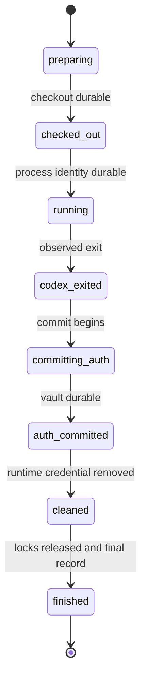
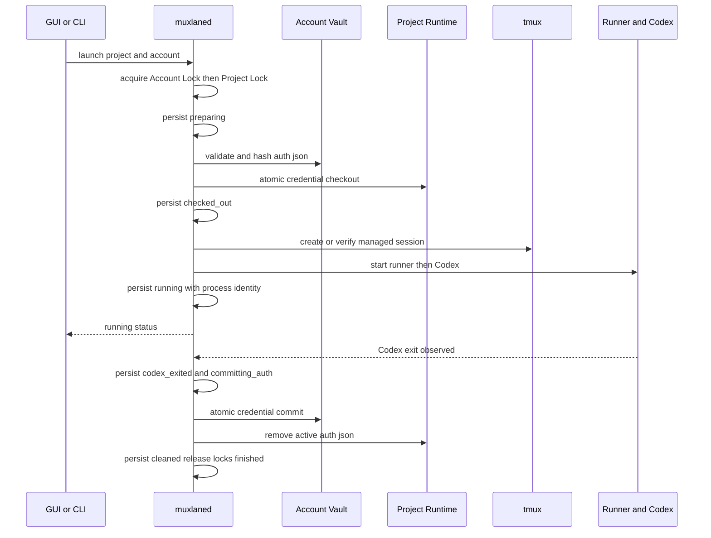
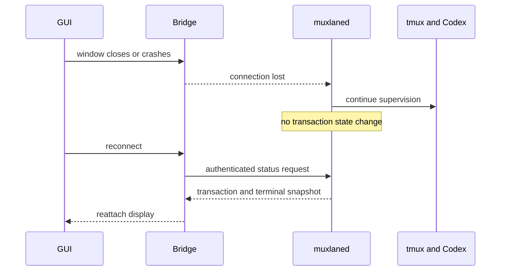
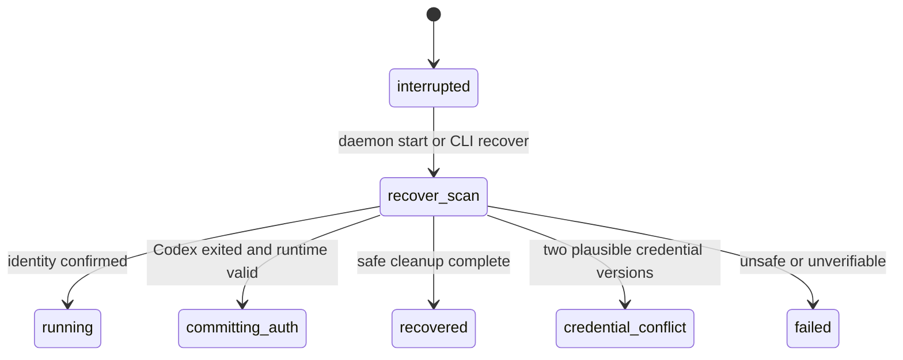

# Muxlane Runtime 生命周期

## 1. 文档状态与适用范围

| 项目     | 内容                                                                                                                 |
| -------- | -------------------------------------------------------------------------------------------------------------------- |
| 状态     | Frozen（阶段 1）                                                                                                     |
| 定义对象 | 一次受管 Codex Launch 的 Project、Account 占用、持久事务、Runner/Codex、tmux 与 GUI 连接生命周期                     |
| 不定义   | SQLite schema、具体 RPC、Windows—WSL 桥接实现、进程信号时间值或 Tauri 命令                                           |
| 权威关联 | 持久状态与恢复以 [Recovery State Machine](RECOVERY_STATE_MACHINE.md) 为准；长期决定见 ADR-0003、ADR-0005 至 ADR-0008 |

本文描述未来 Runtime 的设计约束，不表示 `muxlaned`、Vault、Runner、Socket 或 `tmux` 控制器已经存在。一个生命周期对象不能取代另一个：Project 被归档不等于 Account 已释放，GUI 断线不等于 Codex 退出，tmux Client 消失也不等于 tmux Session 或终端内程序消失。

## 2. 术语和参与组件

| 术语                        | 定义                                                                                                                        |
| --------------------------- | --------------------------------------------------------------------------------------------------------------------------- |
| Project                     | 已注册的工作目录及稳定、路径规范化 hash 派生的 Project ID；其 Runtime 永久归属该 Project，具体归一化仍待 POC。              |
| Account                     | 用户拥有的账号元数据和唯一 Account Vault；不代表团队共享或账号池。                                                          |
| Project Runtime             | `~/.local/share/muxlane/projects/<project-id>/codex-home`，存放 Project 的 `CODEX_HOME` 状态；活动 `auth.json` 仅暂存于此。 |
| Account Vault               | `~/.local/share/muxlane/accounts/<account-id>/`；其 `auth.json` 为长期凭证副本，目录目标权限为 `0700`。                     |
| Launch                      | 请求用一个 Account 在一个非归档 Project 中启动一个受管 Codex 主实例。                                                       |
| Launch Transaction          | 对该 Launch 的 durable、可恢复记录；状态名称和终态由恢复状态机冻结。                                                        |
| Runner                      | 由 `muxlaned` 启动、负责启动/等待 Codex 的受管进程；不是 GUI，也不是 tmux Client。                                          |
| Codex Process               | 设置 `CODEX_HOME=<Project Runtime>` 后实际运行的受管 Codex CLI 子进程。                                                     |
| `muxlaned`                  | WSL Control Plane；拥有持久状态协调、锁、恢复和监督职责。                                                                   |
| tmux Session                | 每个 Project 的持久终端工作区；Session 与连接到它的 tmux Client 独立。                                                      |
| Project Lock / Account Lock | Linux `flock` 互斥；必须共同持有才允许活动 Launch。                                                                         |
| Credential Checkout         | 从 Vault **复制** `auth.json` 到 Runtime，并原子地让其成为活动文件；绝不移动 Vault 原文件。                                 |
| Credential Commit           | Codex 退出后把 Runtime 的可能已刷新凭证原子签回 Vault，再删除 Runtime 活动凭证。                                            |

## 3. 五条彼此独立的生命周期

| 对象               | 正常状态/事件                                                                              | 关键不变量                                                                  |
| ------------------ | ------------------------------------------------------------------------------------------ | --------------------------------------------------------------------------- |
| Project            | registered → active launches → archived                                                    | 归档不是物理删除；归档前无活动 Launch、活动凭证或待处理事务。               |
| Account 占用       | available → 两个锁共同持有期间 reserved → available                                        | Account 的“占用”由真实 Account Lock 证明，而不是 GUI、心跳或 SQLite 标志。  |
| Launch Transaction | `preparing` 到 `finished`，或由 Recovery 进入 `recovered`、`credential_conflict`、`failed` | 每一个安全相关转换先持久化；状态不包含 Token。                              |
| Runner/Codex       | not started → started/observed → exited/unknown                                            | PID 必须结合 boot_id、start ticks 与进程标识验证；不能只以 PID 或心跳判断。 |
| tmux Session       | absent → managed session exists → detached/attached clients → retained or explicit cleanup | Client 断开不销毁 Session；Session 存在不证明 Codex 仍在运行。              |
| GUI 连接           | connected ↔ disconnected/crashed                                                           | GUI 事件不改变凭证事务，除非用户通过受控请求明确停止全部 Project。          |

## 4. 生命周期前置条件

在创建 Launch Transaction 前，`muxlaned` 必须验证：

1. Project 已注册、未归档，Account 可用且属于本机用户。
2. Vault `auth.json` 存在、为可接受格式的常规文件，且权限/父目录符合策略；此检查不记录或输出内容。
3. Project Runtime 位于受控 WSL Linux 数据根，绝不在项目源码、`/mnt/c`、`/mnt/d` 或同步目录。
4. 无阻断当前 Project 或 Account 的 `credential_conflict`、人工处理 `failed` 事务，或未经确认的活动身份。
5. Daemon、Vault、Runtime、transaction、lock 和 Socket 父目录权限正确，且路径解析不经过非预期符号链接。
6. Project Lock 与 Account Lock 都可获得；获取失败必须报告占用或不确定状态，不能抢占、自动切号或仅根据心跳失效。
7. 相关 Project/Account 没有正在恢复的冲突事务；必要时先执行幂等 Recovery。

## 5. 固定锁顺序

**唯一允许的顺序是 `Account Lock → Project Lock`；释放顺序为 `Project Lock → Account Lock`。** 这延续 [ADR-0003](adr/0003-exclusive-project-and-account-locks.md) 和现有总体架构，避免在已冻结设计中制造第二种顺序。所有 Launch、停止、恢复和归档路径都必须遵守它；任何未来改动都必须以新的 ADR 替代 ADR-0003。

固定全局顺序本身消除受管代码路径间的反向等待；Account 先锁定也使同一账号的并行申请在接触 Project Runtime 前失败。它不允许“先获得 Project Lock 再探测 Account Lock”的捷径。Linux `flock` 的实际持有状态优先于锁文件是否存在和 SQLite 可见状态；它与打开文件描述关联，关闭最后一个相关文件描述符时释放。[flock(2)](https://man7.org/linux/man-pages/man2/flock.2.html)

## 6. 正常启动

所有写入均须在目标步骤返回成功后才前进。失败时记录脱敏错误、保持仍需要的证据和凭证副本，并遵循下表的回滚；“回滚”绝不包含覆盖未知 Vault 凭证。

| 步骤 | 动作与持久化                                                                                              | 失败时的动作                                                                              |
| ---- | --------------------------------------------------------------------------------------------------------- | ----------------------------------------------------------------------------------------- |
| 1    | 接收 GUI 或 CLI 的 Launch 请求，校验调用方和输入。                                                        | 拒绝请求；不创建事务、不取得锁。                                                          |
| 2    | 校验 Project、Account、归档/冲突/路径/权限前置条件。                                                      | 记录请求级脱敏错误；不触碰 Vault。                                                        |
| 3    | 获取 **Account Lock**。                                                                                   | 明确返回 Account 占用或不确定；不抢占。                                                   |
| 4    | 获取 **Project Lock**。                                                                                   | 释放 Account Lock，返回 Project 占用；不创建 Runtime 凭证。                               |
| 5    | 创建 durable transaction，生成 `transaction_id`，持久化 `preparing`。                                     | 在仍持有双锁时保留或清理未完成记录；若不能判定，交给 Recovery。                           |
| 6    | 验证 Vault 文件类型、所有者、权限和受控父目录，计算 `vault_hash_before_checkout`。                        | 保持双锁直到安全清理或记为 `failed`；不读写 Runtime 凭证。                                |
| 7    | 以同目录临时文件、`0600`、写入/验证、文件 `fsync`、rename、父目录 `fsync` 原子复制到 Runtime。            | 清理受控临时文件；若 rename 或持久化结果不确定，留给 Recovery 检查 Hash。                 |
| 8    | 验证 Runtime `auth.json` 的类型、模式、Hash 和父目录，持久化 `checked_out`。                              | 绝不把 Runtime 副本自动写回 Vault；走 Hash 决策与 Recovery。                              |
| 9    | 创建或附加经过身份验证的 Project tmux Session。                                                           | 保留 `checked_out` 和双锁，执行无 Codex 的 Recovery/清理；不把未知同名 Session 视为受管。 |
| 10   | 启动受管 Runner；Runner 用受控环境启动 Codex。                                                            | 记录未启动或失败；不得假定 checkout 未发生。                                              |
| 11   | 读取并验证 Runner/Codex PID、当前 `boot_id`、`/proc/<pid>/stat` start ticks 与 cmdline/process identity。 | 若无法确认，停止进一步操作并进入 Recovery/人工处理；不杀未知进程。                        |
| 12   | 事务持久化 `running` 后，才向 GUI/CLI 报告成功。                                                          | 如果进程已启动但写入失败，保留双锁尽力监督；Daemon 重启时必须身份重验。                   |

### 6.1 正常启动状态图

### 6.2 正常 Launch 时序

## 7. 正常运行与退出

### 7.1 正常运行

- GUI 可以断开、重连、最小化、退出或崩溃；tmux 保持终端，`muxlaned` 继续监督 Runner/Codex。
- Heartbeat 只用于健康展示和用户诊断。实际退出应以 `waitpid` 或等效的受控子进程事件、再结合身份验证确认；心跳过期不能释放锁、签回凭证或杀进程。
- Codex 在运行期间可能更新 Runtime `auth.json`，因此退出前必须重新读取、验证和计算 Hash。
- tmux Client 可以被 GUI Bridge 断开而 Session 和其中程序继续。上游 tmux 定义 Client 附着到 Session，Session 可以没有 Client；不能以客户端消失判断受管进程退出。[tmux(1)](https://man7.org/linux/man-pages/man1/tmux.1.html)

### 7.2 正常退出

`/exit`、EOF、正常子进程退出、用户中断后**实际**退出都走同一收尾流程：

1. 观察并验证 Codex 已退出，持久化 `codex_exited`。
2. 在双锁仍持有时读取 Runtime `auth.json`，验证类型、权限和受控路径。
3. 持久化 `committing_auth`，比较当前 Vault Hash、签出前 Hash 与 Runtime Hash。
4. 若无冲突，使用原子 Credential Commit 签回 Vault，持久化 `auth_committed`。
5. 删除 Runtime `auth.json`，清理受控临时文件，持久化 `cleaned`。
6. 释放 Project Lock，再释放 Account Lock。
7. 记录 `finished` 并向 GUI/CLI 发布结果。

锁不得在凭证签回完成前释放。Runtime 文件缺失、损坏、模式异常、Vault Hash 在 Commit 中变化或 commit 写入失败都不得标记 `finished`：前者按 [Hash 冲突矩阵](RECOVERY_STATE_MACHINE.md#7-hash-冲突决策矩阵) 进入可验证清理、`failed` 或 `credential_conflict`。

## 8. 用户停止、GUI 与 Daemon 事件

### 8.1 用户停止与强制停止

1. “停止”先向经身份验证的受管 Codex 请求优雅退出，并开始等待。
2. 若用户选择中断，发送受控中断（例如 Ctrl+C）；发送信号只表示请求已发出，**不**表示进程已退出。
3. 到实现时定义的等待上限后，可按已批准策略升级终止 Codex；只有在重新验证身份后才可发送信号。
4. 若仍未退出，可终止 Runner；强杀、Runner 异常或身份不可确认一律转入 Recovery，不得直接释放锁或签回。
5. 默认保留已验证的 tmux Session 以供诊断和重连；仅在没有受管 Codex、无凭证事务且用户明确请求或恢复策略允许时清理。未知 tmux Session 禁止操作。

### 8.2 GUI 关闭和重连

窗口关闭、缩到托盘、GUI 完全退出、GUI 崩溃和 Windows WebView 崩溃都仅是 GUI 连接事件。只有用户明确经控制面选择“停止全部 Project”才开始 8.1；GUI 本身不是凭证事务的唯一恢复入口。

### 8.3 Daemon、WSL 和断电

优雅停止 Daemon 时，先拒绝新 Launch。若存在 `running` 或签回中的事务，Daemon 不得“看似正常”地退出并遗留无监督 Codex：它必须完成已验证的收尾，或按显式用户请求停止并进入 Recovery。Daemon 被杀、WSL 被 `wsl --terminate`、Windows 重启或断电时，不能同步假设清理完成；内核会随持锁进程消失释放 `flock`，下次 Daemon 启动必须使用持久事务、Hash、tmux 与进程身份恢复。Microsoft 文档明确 `wsl --terminate <Distribution Name>` 会停止指定发行版，`wsl --shutdown` 会立即终止运行中的 WSL2 发行版和轻量 VM。[WSL commands](https://learn.microsoft.com/windows/wsl/basic-commands)

### 8.4 项目归档

归档必须幂等，且只逻辑归档、不自动物理删除。操作前必须确认：无 `running`/签回事务、无 Runtime `auth.json`、无待签回事务、无真实活动锁；如任一条件不能验证，归档被拒绝并要求 CLI Recovery。归档不能通过删除锁文件、删除未知 Session 或忽略 `credential_conflict` 来完成。

## 9. 异常转入 Recovery

## 10. 失败矩阵

| 中断点                               | 磁盘上可能状态                               | 锁状态                            | 下次启动判断                               | 自动恢复 / 幂等入口                                                |
| ------------------------------------ | -------------------------------------------- | --------------------------------- | ------------------------------------------ | ------------------------------------------------------------------ |
| 获取 Project Lock 前                 | 无新事务/Runtime 凭证                        | Account Lock 可能尚未取得或已释放 | 无活动 Launch                              | 若只 Account Lock 曾成功则进程退出已释放；重试完整 Launch。        |
| 已获 Account Lock、未获 Project Lock | 无 Runtime 变化                              | Account Lock 可能持有             | 仅查询真实 `flock` 与事务                  | 释放 Account Lock 或进程死亡后重试；不留下占用记录。               |
| 事务创建后                           | `preparing`，无 Runtime 凭证或不确定临时文件 | 双锁可能已释放于崩溃              | 事务、临时文件、Vault/Runtime Hash         | 自动清理经验证临时文件并标 `recovered`；不确定则 `failed`。        |
| checkout 前                          | `preparing`，Vault 原件不变                  | 双锁应持有或崩溃释放              | Runtime 是否不存在、Vault Hash             | 可幂等重试 checkout 或安全完成恢复。                               |
| checkout 临时文件写入中              | 临时文件可能部分存在                         | 同上                              | 仅信任经验证的最终 Runtime 文件            | 删除受控临时文件；不签回部分内容。                                 |
| rename 后、目录 fsync 前             | Runtime 最终名可能存在但持久性不确定         | 同上                              | 检查 Runtime 文件/Hash 与事务              | 不假设 checkout 成功；Recovery 以 Hash 和文件验证决定清理或继续。  |
| `checked_out` 后、Codex 启动前       | 有 Runtime 凭证，未见 Codex                  | 双锁或崩溃后无锁                  | 进程不存在、tmux identity、Hash            | 可自动提交/清理仅依 Hash 矩阵；冲突则人工。                        |
| Codex 启动后、`running` 持久化前     | Runtime 凭证和可能的 Runner/Codex            | 崩溃时 `flock` 已释放             | boot_id、PID、start ticks、cmdline、tmux   | 身份确认则重建监督并记录 `running`；不确定不得杀。                 |
| `running`                            | Runtime 凭证可能被刷新，进程可能存在         | 应持有；崩溃后不再持有            | 完整进程身份优先，再检查 Hash              | 进程活则恢复监督；退出则进入 commit 判断；不明则人工。             |
| `codex_exited` 后                    | Runtime 凭证仍在                             | 双锁应持有或已释放                | 无 Codex 身份、Runtime/Vault Hash          | 执行幂等 commit 或冲突流程。                                       |
| `committing_auth` 中                 | Vault、Runtime、临时/备份可能并存            | 同上                              | 所有候选副本 Hash、文件类型和事务          | 可重复检查；绝不重复覆盖未知 Vault，必要时 `credential_conflict`。 |
| `auth_committed` 后、Runtime 删除前  | Vault 已是目标版本，Runtime 副本仍在         | 双锁应持有或已释放                | Vault Hash 与已提交 Hash，Runtime 是否同值 | 仅在确认 Vault 后删除 Runtime；然后 `cleaned`/`recovered`。        |
| `cleaned` 后、`finished` 前          | 无活动 Runtime 凭证，Vault 已完成            | 可能刚释放或崩溃释放              | 清理证据、无活动进程、无 Runtime auth      | 自动标 `recovered`；不伪造原正常 `finished` 记录。                 |

## 11. 后续 POC 的事实边界

阶段 2 必须验证 WSL Linux 文件系统上的目录权限和 `fsync` 故障语义、`auth.json` 刷新与格式接受范围及 Account 接管；阶段 3 必须验证 tmux Socket 与 Client/Session 行为、Windows—WSL 受控桥接身份绑定、重连、背压和 Tauri Capability 配置；阶段 4 必须验证实际 Runner/Codex 进程树、PID/boot_id/start ticks、锁、故障注入和冲突 Recovery。文件 `fsync`、目录 `fsync` 和同目录 rename 是设计要求，不应被解释为在所有挂载或断电模型中已证明的绝对保证；必须进行故障注入。
