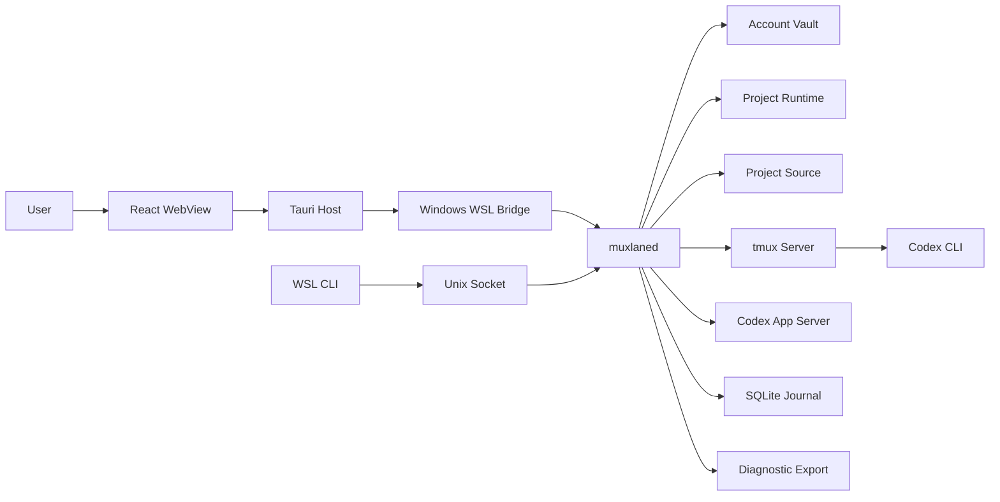

# Muxlane 威胁模型

## 1. 文档状态、范围与证据

| 项目       | 内容                                                                                                                                      |
| ---------- | ----------------------------------------------------------------------------------------------------------------------------------------- |
| 状态       | Frozen（阶段 1）                                                                                                                          |
| 覆盖范围   | Windows 10/11 GUI、Tauri Host、默认 WSL2 发行版、计划中的 `muxlaned`、CLI、Project Runtime、Account Vault、`tmux`、本地 SQLite 与诊断导出 |
| 不在范围内 | 云端服务、团队共享账号、多租户、远程 LAN 控制面、正式实现代码、真实账号或凭证                                                             |
| 安全模型   | 保护当前 WSL Linux 用户的凭证、项目与本地控制面；不假设 Windows 主机或该 WSL 用户账户已完全失陷                                           |

这是后续实现和安全测试的冻结设计，不表示任何 Runtime、Vault、Socket 或桥接已经实现。架构证据来自 [PRD](PRD.md)、[总体架构](ARCHITECTURE.md)、[ADR-0001](adr/0001-windows-gui-wsl-control-plane.md) 到 [ADR-0004](adr/0004-json-rpc-over-local-transport.md)。当前仓库只包含阶段 0 骨架；本文中的控制措施均为未来实现要求，不能误读为已有防护。后续 POC 若推翻本设计，必须通过新的 ADR 修订。

本模型使用 Linux 本地文件系统与受限 WSL 发行版作为前提。Linux 的 `flock(2)` 是与打开文件描述关联的建议锁，最后一个相关文件描述符关闭后释放；它不是跨组件的持久状态数据库。[flock(2)](https://man7.org/linux/man-pages/man2/flock.2.html) [fsync(2)](https://man7.org/linux/man-pages/man2/fsync.2.html) 说明：文件 `fsync` 不保证目录项持久化，目录文件描述符也需 `fsync`。同一挂载文件系统内的 `rename` 才能作为原子替换前提，跨挂载点会失败为 `EXDEV`。[rename(2)](https://man7.org/linux/man-pages/man2/rename.2.html)

Windows—WSL 桥接、具体 Tauri Capability、Socket 身份绑定、文件系统实现差异和 Codex CLI 的 `auth.json` 刷新行为仍需 POC；本文不将其写成已确认的实现事实。Tauri 的 WebView 与 Rust Host 是权限边界，Capability/Permission 只授予被明确配置的 IPC 权限，且过宽 Rust 命令和 scope 仍会破坏这一边界。[Tauri Security](https://v2.tauri.app/security/) [Tauri Capabilities](https://v2.tauri.app/security/capabilities/)

## 2. 资产与安全目标

| 资产                                                                   | 主要目标 | 失陷后果                                        |
| ---------------------------------------------------------------------- | -------- | ----------------------------------------------- |
| Account Vault `auth.json`、access token、refresh token                 | C、I     | 账号接管、会话刷新竞争或不可恢复的凭证覆盖      |
| Account 元数据                                                         | C、I     | 账号关联泄露、错误账户被选中或锁定关系损坏      |
| Project Runtime（含活动 `auth.json`、`config.toml`、Sessions/Threads） | C、I、A  | 跨项目串号、配置执行、会话与历史损坏            |
| Project 源码                                                           | C、I     | 未授权读取、篡改或借助恶意仓库配置攻击控制面    |
| Muxlane SQLite 与 Launch Transaction                                   | I、A     | 恢复决策错误、审计不可用；绝不应成为 Token 存储 |
| Project/Account 锁文件与持有的 `flock`                                 | I、A     | 同账号并行 refresh 或同项目多实例损坏           |
| `tmux` Socket、Session、终端输入输出                                   | C、I、A  | 终端劫持、命令注入、输出和 Prompt 泄露          |
| `muxlaned` Unix Socket 与 GUI Bridge                                   | I、A     | 未授权控制、越权启动或停止 Runtime              |
| Prompt 历史、日志与诊断包                                              | C        | 代码、路径、命令、Prompt 或凭证外泄             |
| 更新包、迁移数据、依赖与 GitHub Actions                                | I、A     | 供应链执行、恶意升级或状态格式损坏              |

## 3. 威胁参与者与安全边界

### 3.1 威胁参与者

| 参与者                             | 现实能力与限制                                                                                                            |
| ---------------------------------- | ------------------------------------------------------------------------------------------------------------------------- |
| 恶意或被篡改的 Project / 仓库配置  | 可控制项目路径、文件名、源码、`config.toml`、`.codex`、Skill/MCP/Plugin 配置与终端输出；不应默认拥有 Vault 路径读写权限。 |
| WebView/XSS 内容                   | 可驱动前端可调用的 IPC；不得因此获得任意 Shell、Vault、全盘文件或任意 Tauri 命令。                                        |
| 同一 Linux 用户的其他进程          | 可能试图连接可访问 Socket、替换可写路径、抢占名称或读取权限错误的文件；同一 UID 已能读取的秘密不能靠应用层完全保护。      |
| 权限不同的本地用户                 | 不应读取 `0700` Vault 或 `0600` 文件；管理员、root、已完全失陷的 Windows 或 WSL 用户账户不在本模型防护保证内。            |
| 意外配置错误、软件缺陷、用户误操作 | 可能扩大 Capability、错误归档、覆盖文件、输入错误 Account，或中断迁移。                                                   |
| 崩溃、断电、WSL/Windows 重启       | 可在任意原子步骤间中断，造成陈旧锁文件、部分事务、进程身份失真和凭证副本并存。                                            |
| 供应链攻击者                       | 可通过依赖、GitHub Action、更新包、恶意扩展或被替换的可执行文件影响构建或运行。                                           |

非能力假设：不暴露 LAN 监听；不支持团队共享账号或云端凭证服务；不把攻击者仅能控制远程网页视为可直接访问 WSL Unix Socket。若未来加入远程内容、共享账号或网络控制面，必须重新评估本模型。

### 3.2 信任边界图

| 边界                                     | 穿越的数据/能力                  | 目标控制                                                                      |
| ---------------------------------------- | -------------------------------- | ----------------------------------------------------------------------------- |
| React WebView → Tauri Host               | 用户动作、显示状态、受限控制请求 | Capability 最小化、每个命令显式授权、输入 schema、无任意 Shell/文件读写       |
| Windows → WSL / GUI Bridge → `muxlaned`  | 经认证的本机控制请求             | 候选桥接 POC 验证身份、重连、无 LAN、长度限制与错误隔离                       |
| CLI → Unix Socket → `muxlaned`           | 诊断、恢复与受限控制             | 当前 Linux 用户专用目录/Socket 权限、版本握手、请求授权；不以路径存在代替认证 |
| `muxlaned` → Account Vault               | 凭证读取、签回、Hash             | 固定受控根、`0700/0600`、无跟随符号链接、同目录原子写入、无 Token 日志/数据库 |
| `muxlaned` → Project Runtime             | 临时活动凭证、Runtime 文件       | Project ID 映射、路径规范化、活动事务与双锁、运行后清理                       |
| `muxlaned` → Project 源码目录            | 工作目录、受限文件/配置访问      | Project 注册路径验证、禁止 Runtime 在源码树；将仓库配置视为不可信输入         |
| `muxlaned` → `tmux` / Codex / App Server | 命令、环境、终端字节流           | 固定可执行与参数白名单、专用 Socket/Session 名、转义过滤与进程身份验证        |
| `muxlaned` → SQLite                      | 元数据、事务、摘要错误           | Token 禁入、事务完整性、schema/migration 备份和故障恢复                       |
| 诊断包 → 用户选择的导出路径              | 脱敏状态、日志、版本信息         | 显式确认、默认最少内容、脱敏扫描、受控文件名、导出后审计提示                  |

## 4. 风险分级与评估方法

Likelihood 以攻击前置条件、攻击面与实现复杂度分为 Low、Medium、High；Impact 以对凭证、账号完整性、项目完整性和可恢复性影响分为 Low、Medium、High、Critical。Overall Risk 取两者并结合现有设计缺口：Critical（可导致 Token/账号失陷或不可逆凭证丢失）、High（可越权控制或显著破坏隔离/恢复）、Medium（需额外前置条件或影响可隔离）、Low（影响有限且可容易恢复）。MVP blocker 为所有 Critical 和标记为“是”的 High；缓解阶段是最早允许依赖该能力的阶段。

## 5. 威胁场景登记

下表的“控制”标识指向 5.1 的具体预防（P）、检测（D）、恢复（R）和验证（V）。状态、锁和文件语义以 [Runtime Lifecycle](RUNTIME_LIFECYCLE.md) 与 [Recovery State Machine](RECOVERY_STATE_MACHINE.md) 为准。

| ID     | STRIDE | 场景                                                     | L / I / 风险     | MVP 阻断 | 控制               |
| ------ | ------ | -------------------------------------------------------- | ---------------- | -------- | ------------------ |
| TM-001 | I      | `auth.json`、Token 或其可还原片段写入普通日志            | M / C / Critical | 是       | P1、D1、R1、V1     |
| TM-002 | I      | Token 被序列化到 SQLite、错误详情或事务字段              | M / C / Critical | 是       | P2、D2、R2、V2     |
| TM-003 | E      | WebView/XSS 触发任意 Shell、任意 Tauri 命令或 Vault 读取 | M / C / Critical | 是       | P3、D3、R3、V3     |
| TM-004 | E      | Tauri 命令、Plugin 或 scope 过宽                         | M / H / High     | 是       | P4、D4、R4、V4     |
| TM-005 | S/E    | 未授权本地进程调用 Daemon Socket                         | M / H / High     | 是       | P5、D5、R5、V5     |
| TM-006 | S/E    | `tmux` Socket 授权错误导致终端控制                       | M / H / High     | 是       | P6、D6、R6、V6     |
| TM-007 | T/E    | Project ID、路径或导出文件名路径穿越                     | M / H / High     | 是       | P7、D7、R7、V7     |
| TM-008 | T/E    | 符号链接替换 Vault、Runtime、临时或锁文件                | M / C / Critical | 是       | P8、D8、R8、V8     |
| TM-009 | T      | 路径检查与打开之间发生 TOCTOU                            | M / H / High     | 是       | P8、D8、R8、V8     |
| TM-010 | T/E    | 恶意 Runtime `config.toml` 影响受管启动                  | M / H / High     | 是       | P9、D9、R9、V9     |
| TM-011 | E      | 恶意 `.codex`、Skill、MCP 或 Plugin 执行越权行为         | H / C / Critical | 是       | P10、D10、R10、V10 |
| TM-012 | T      | 签回覆盖已变化的 Vault 凭证                              | M / C / Critical | 是       | P11、D11、R11、V11 |
| TM-013 | T/A    | 同 Account 并行 refresh 或签回竞争                       | H / C / Critical | 是       | P12、D12、R12、V12 |
| TM-014 | T/A    | 同 Project 多受管主实例损坏 Session/SQLite               | M / H / High     | 是       | P12、D12、R12、V12 |
| TM-015 | S/T    | PID 重用将无关进程认作 Codex                             | M / H / High     | 是       | P13、D13、R13、V13 |
| TM-016 | T/A    | WSL 重启后陈旧 PID/状态被当作活动 Runtime                | M / H / High     | 是       | P13、D13、R13、V13 |
| TM-017 | T      | `flock` 与 SQLite 占用记录不一致而错误抢占               | M / H / High     | 是       | P12、D12、R12、V12 |
| TM-018 | T/A    | 事务日志部分写入或 rename 后目录未持久化                 | H / H / High     | 是       | P14、D14、R14、V14 |
| TM-019 | T/A    | SQLite 损坏导致恢复错误或审计丢失                        | M / H / High     | 是       | P15、D15、R15、V15 |
| TM-020 | T/A    | SQLite 迁移中断                                          | L / H / Medium   | 否       | P15、D15、R15、V15 |
| TM-021 | S/T    | `tmux` Session 命名冲突或同名非受管 Session              | M / H / High     | 是       | P16、D16、R16、V16 |
| TM-022 | E/I    | 终端转义序列注入改变 UI 或诱导操作                       | M / H / High     | 是       | P17、D17、R17、V17 |
| TM-023 | I/E    | 剪贴板、OSC 52 或标题序列外泄/越权                       | M / H / High     | 是       | P17、D17、R17、V17 |
| TM-024 | I      | Prompt、终端历史或日志泄露                               | H / H / High     | 是       | P18、D18、R18、V18 |
| TM-025 | I      | 诊断包包含 Token、Prompt、路径或终端原文                 | M / H / High     | 是       | P19、D19、R19、V19 |
| TM-026 | I/T    | Project 归档后仍遗留活动凭证                             | M / C / Critical | 是       | P20、D20、R20、V20 |
| TM-027 | T/E    | 更新包、迁移包或下载可执行文件被篡改                     | M / C / Critical | 是       | P21、D21、R21、V21 |
| TM-028 | T/E    | 依赖或 GitHub Action 供应链被篡改                        | M / C / Critical | 是       | P21、D21、R21、V21 |

### 5.1 High 与 Critical 威胁的控制闭环

| 组                    | 预防控制                                                                                                                  | 检测控制                                                   | 恢复控制                                                                     | 验证方法                                       | 剩余风险                                                  |
| --------------------- | ------------------------------------------------------------------------------------------------------------------------- | ---------------------------------------------------------- | ---------------------------------------------------------------------------- | ---------------------------------------------- | --------------------------------------------------------- |
| P1–P2 / TM-001–002    | Token 类型不进入结构化字段；日志 API 仅接受脱敏事件；禁止序列化原始凭证                                                   | pre-commit/CI 敏感模式扫描，日志和 SQLite fixture 扫描     | 隔离泄露产物、轮换/重新登录、保留脱敏事件                                    | 单元、集成、导出包和数据库扫描                 | 同一用户可读取的进程内内存仍不受文件权限完全保护          |
| P3–P4 / TM-003–004    | 每个 WebView 命令与 scope 显式白名单；无 shell、Vault 或通配文件权限；Host 重新验证所有参数                               | Capability manifest 审查、拒绝调用审计、WebView 安全测试   | 撤销有问题 Capability，阻断敏感操作并要求升级                                | Tauri IPC 负向测试、XSS 驱动调用测试、权限快照 | Tauri Rust 核心或系统 WebView 漏洞需依赖上游修复          |
| P5–P6 / TM-005–006    | Socket 置于当前用户受限目录；每次请求授权、版本和长度验证；tmux 使用受控 Socket/名称                                      | 权限检查、拒绝请求计数、异常 Session 审计                  | 停止暴露 Socket、重建受控 Socket/Session、保留事务                           | 同 UID/不同 UID 连接测试、Socket 权限测试      | 同 UID 恶意进程是强对手；需要最小化可调用能力             |
| P7–P9 / TM-007–010    | Project ID 由受控路径规范化 hash 派生且不含原路径；路径在受控根解析；基于目录 fd 的 no-follow 打开；配置按 allowlist 解析 | 路径拒绝、inode/权限变化和配置校验日志                     | 隔离可疑路径/配置，标记失败而非继续启动                                      | 路径遍历、符号链接、竞态和恶意配置测试         | 文件系统语义和 Windows 挂载边界需 POC                     |
| P10 / TM-011          | 将 Project 配置、Skill、MCP、Plugin 视为不可信；来源、checksum、显式启用和最小权限                                        | Asset 清单、来源/校验和审计、异常子进程日志                | 禁用资产、隔离 Project、保留取证副本                                         | 恶意 fixture、Parser fuzz 候选、权限回归       | 受支持 Codex 扩展语义需用官方行为 POC 约束                |
| P11 / TM-012          | Checkout 前和 Commit 前比较 Vault/Runtime Hash；同目录原子写入；永不 last-write-wins                                      | Hash 不匹配事件、备份存在性检查                            | 进入 `credential_conflict`，保留 Vault/Runtime/签出前副本，人工重新登录/处理 | 冲突矩阵、断电与重复恢复测试                   | Hash 不能解释“哪个凭证更正确”，故必须人工处理             |
| P12 / TM-013–014、017 | **Account Lock → Project Lock**，两个 `flock` 都成功才可继续；数据库仅为索引                                              | 锁冲突、事务/进程身份交叉检查                              | 不抢占；活动锁存在则只报告，陈旧记录经 Recovery 重判                         | 并发启动、崩溃和锁文件存在性测试               | 建议锁需所有受管路径遵守，外部非受管 Codex 不可被完全约束 |
| P13 / TM-015–016      | 组合 `boot_id`、PID、`/proc/<pid>/stat` start ticks、cmdline identity；不能确认则不杀                                     | 启动时身份重验和 boot_id 变更报告                          | 进入恢复/人工处理，绝不杀未知进程                                            | PID 重用模拟、WSL terminate/restart 故障注入   | 同一 boot_id 内极端竞态仍需实现时慎重处理                 |
| P14–P15 / TM-018–020  | 持久事务、写临时文件、`fsync`、同目录 rename、父目录 `fsync`；迁移备份/版本闸门                                           | 启动扫描未完成事务、SQLite integrity 与 migration 状态检查 | 幂等恢复、隔离损坏文件/DB、人工处理不可判定状态                              | 每一步 kill、磁盘满、损坏 SQLite、迁移中断测试 | 实际 WSL 文件系统持久化保证须 POC 和故障注入验证          |
| P16–P17 / TM-021–023  | Session 名派生自不透明 Project ID 并验证受管标记；终端字节流按安全策略处理，默认禁止 OSC 52                               | Session identity 失配、序列过滤计数                        | 不附加未知 Session，隔离显示/重建受管桥接                                    | 同名 tmux、控制序列与剪贴板负向测试            | 终端仿真差异和可访问性需求须单独评审                      |
| P18–P20 / TM-024–026  | 历史上限、默认无遥测、日志脱敏；归档前无活动事务和 Runtime `auth.json`                                                    | 敏感扫描、归档前置检查、导出 manifest                      | 隔离导出包/遗留副本，重新登录，归档操作可重试                                | 日志/诊断脱敏、归档与恢复集成测试              | 用户主动复制或同 UID 读取不能由应用撤回                   |
| P21 / TM-027–028      | 固定依赖与 Action commit、来源验证、更新签名/校验和与迁移兼容门                                                           | CI 依赖审计、checksum/签名失败、变更审查                   | 拒绝升级、保留旧可用版本和备份、人工回滚流程                                 | 篡改包、失败迁移、Action/lockfile 审计         | 上游零日和开发机失陷仍需要发布流程与响应                  |

## 6. 冻结的安全不变量

1. Token 不进入 SQLite、普通日志、遥测或诊断包。
2. WebView 不直接读取 Account Vault，且不能执行任意 Shell。
3. Runtime `auth.json` 只在活动 Launch Transaction 期间存在。
4. Account Lock 与 Project Lock 必须同时持有；锁冲突不能静默抢占。
5. `credential_conflict` 不得自动覆盖或自动选择凭证。
6. 诊断包必须脱敏，默认无遥测，控制面不开放 LAN 监听。
7. Unix Socket 只允许当前 Linux 用户的受控客户端使用。
8. Project 归档前不得遗留活动凭证或待签回事务。
9. 敏感文件操作不得跟随非预期符号链接，且必须验证类型、权限和受控父目录。
10. 心跳、锁文件路径存在、SQLite 状态、单独 PID 或 tmux Session 存在都不是活动 Runtime 的最终真相。

## 7. 实现阶段映射

| 阶段 | 必须交付或 POC 验收的缓解措施                                                     |
| ---- | --------------------------------------------------------------------------------- |
| 2    | Runtime 受控路径、Project ID、凭证刷新与 Account 接管、路径遍历/符号链接 POC      |
| 3    | Terminal、Bridge、重连、背压、tmux identity 与 Tauri 最小权限 POC                 |
| 4    | 双 `flock`、Durable Launch Transaction、Hash 冲突矩阵、进程身份和故障注入         |
| 5    | Daemon/CLI Socket 授权、SQLite 迁移/恢复、控制协议、CLI Recovery 与结构化脱敏日志 |
| 6    | GUI 重连不改变事务、Capability 审计、Prompt/历史最小化、Usage 不触发切号          |
| 7    | Skill/MCP/Plugin 资产来源治理、Project 文件访问边界、诊断导出脱敏                 |
| 8    | 更新包与供应链校验、升级/迁移回滚、发布响应、持续敏感信息扫描                     |

## 8. 安全测试计划

| 测试类别     | 后续验收                                                                                       |
| ------------ | ---------------------------------------------------------------------------------------------- |
| 单元测试     | 状态合法转换、Hash 决策、脱敏器、Project ID/路径规范化、错误码不泄露敏感内容                   |
| 集成测试     | 受管 Launch、正常退出签回、CLI recovery、归档前置条件、GUI 断开重连                            |
| 权限测试     | `0700/0600`、Socket/tmux Socket、Tauri Capability 与命令 scope 的允许和拒绝案例                |
| 故障注入     | checkout/commit 写入、rename 后目录 `fsync` 前、Daemon/Runner/Codex/WSL 终止、磁盘满、权限改变 |
| 模糊测试候选 | JSON-RPC 解码、配置解析、路径/ID 输入、终端控制序列、诊断脱敏规则                              |
| 敏感信息扫描 | Git 工作树、日志、SQLite、导出包、fixture、迁移备份与构建产物的 Token/auth.json 模式           |
| 攻击回归     | 路径穿越、符号链接替换、TOCTOU、同 Account 并发、同 Project 重复启动、Hash 冲突、tmux 同名冲突 |
| 升级测试     | 迁移中断、不可兼容 schema、篡改更新包、回滚与备份恢复                                          |

任何测试都不得使用真实 `auth.json`、Token、Cookie、邮箱、Prompt 或用户路径；使用合成、不可认证的 fixture。每个 High/Critical 场景的通过标准是：不会导致 Token 丢失或串号、不会自动覆盖冲突、不会误杀身份不明的进程，并留下脱敏且可操作的诊断结果。
